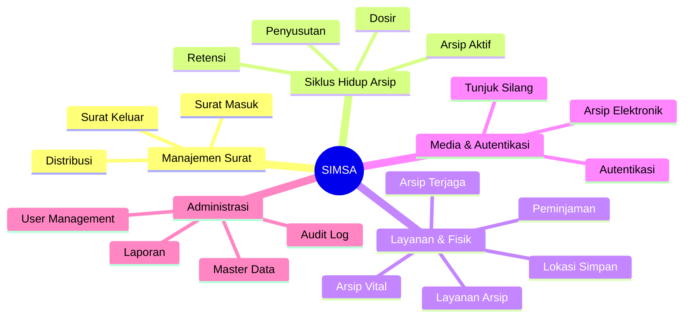
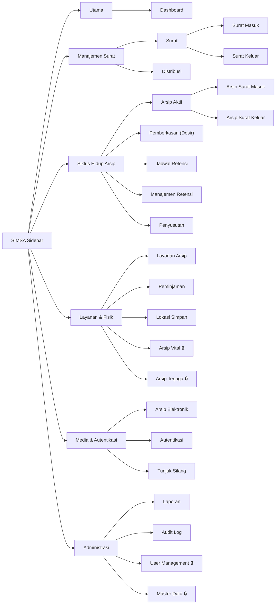
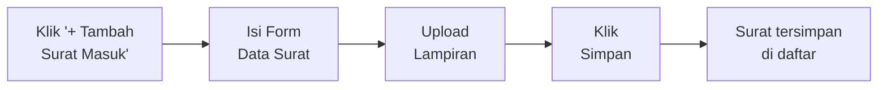
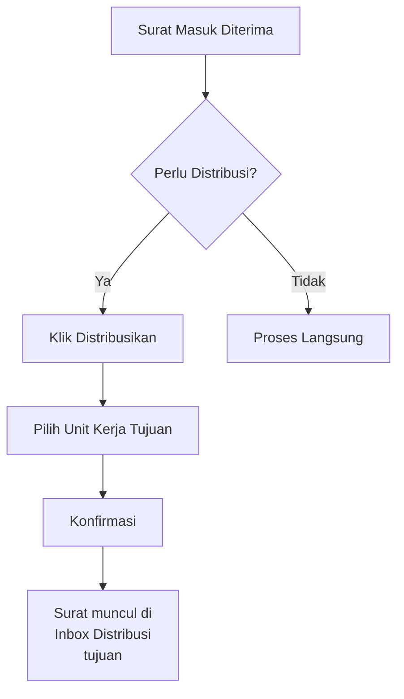
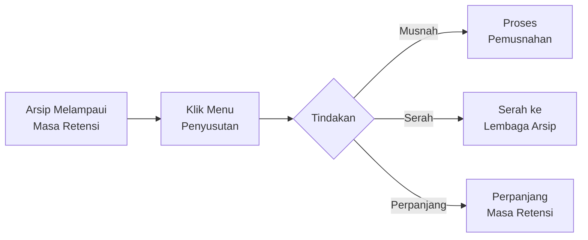
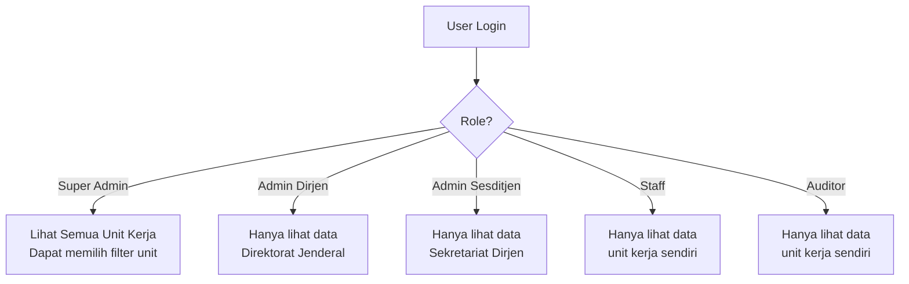
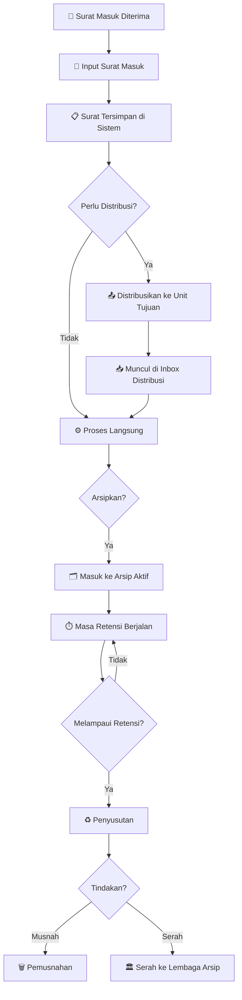
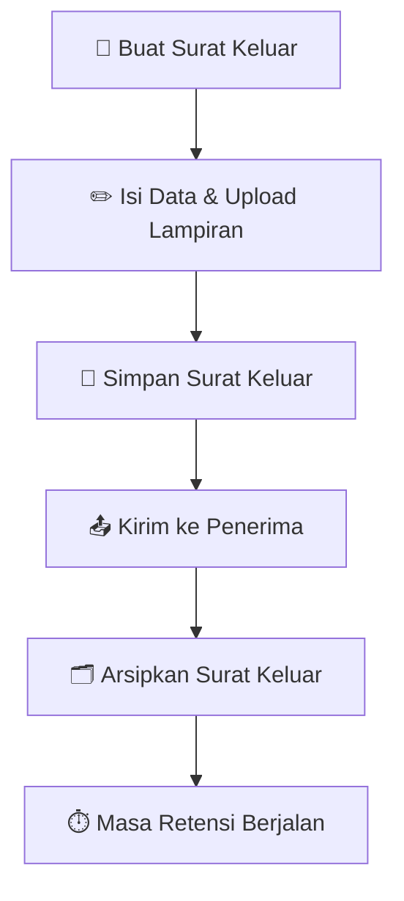

# 📘 Buku Panduan Penggunaan Aplikasi SIMSA

**Sistem Informasi Manajemen Surat & Arsip**
*Kementerian ATR/BPN — Dirjen PTPP*

> Versi 1.0.0 (BETA) | Terakhir diperbarui: Februari 2026

---

## Daftar Isi

1. [Pendahuluan](#1-pendahuluan)
2. [Login](#2-login)
3. [Dashboard](#3-dashboard)
4. [Navigasi Sidebar](#4-navigasi-sidebar)
5. [Manajemen Surat](#5-manajemen-surat)
   - 5.1 Surat Masuk
   - 5.2 Surat Keluar
   - 5.3 Distribusi Surat
6. [Siklus Hidup Arsip](#6-siklus-hidup-arsip)
   - 6.1 Arsip Aktif
   - 6.2 Pemberkasan (Dosir)
   - 6.3 Jadwal Retensi Arsip
   - 6.4 Manajemen Retensi
   - 6.5 Penyusutan Arsip
7. [Layanan & Fisik](#7-layanan--fisik)
   - 7.1 Layanan Arsip
   - 7.2 Peminjaman Arsip
   - 7.3 Lokasi Simpan
   - 7.4 Arsip Vital
   - 7.5 Arsip Terjaga
8. [Media & Autentikasi](#8-media--autentikasi)
   - 8.1 Arsip Elektronik
   - 8.2 Autentikasi Arsip
   - 8.3 Tunjuk Silang
9. [Administrasi](#9-administrasi)
   - 9.1 Laporan
   - 9.2 Audit Log
   - 9.3 User Management
   - 9.4 Master Data
   - 9.5 Settings
10. [Hak Akses Berdasarkan Role](#10-hak-akses-berdasarkan-role)

---

## 1. Pendahuluan

**SIMSA** (Sistem Informasi Manajemen Surat & Arsip) adalah aplikasi web yang dirancang untuk mengelola surat masuk, surat keluar, dan arsip di lingkungan **Kementerian Agraria dan Tata Ruang / Badan Pertanahan Nasional (ATR/BPN)**, khususnya **Direktorat Jenderal Penataan Pertanahan dan Pemanfaatan Pertanahan (PTPP)**.

### Fitur Utama SIMSA



### Persyaratan Sistem

| Komponen | Minimum |
|----------|---------|
| Browser | Google Chrome 90+, Firefox 90+, Edge 90+ |
| Koneksi Internet | Stabil (minimal 1 Mbps) |
| Resolusi Layar | 1024 × 768 (direkomendasikan 1920 × 1080) |

---

## 2. Login

Halaman login adalah halaman pertama yang Anda lihat saat mengakses SIMSA di `https://simsa-frontend.vercel.app/`.

> [!IMPORTANT]
> SIMSA adalah sistem internal pemerintah. **Pendaftaran akun baru tidak tersedia secara publik.** Akun pengguna hanya dapat dibuat oleh **Super Admin** melalui menu [User Management](#93-user-management). Hubungi Super Admin di unit kerja Anda jika belum memiliki akun.

### 2.1 Tampilan Halaman Login

Halaman login memiliki desain modern dengan latar belakang gradien biru. Di bagian atas terdapat **logo SIMSA** dan teks "Sistem Informasi Manajemen Surat & Arsip — ATR/BPN - Dirjen PTPP".

Halaman login terdiri dari:

```
┌─────────────────────────────────────────────┐
│                                             │
│              🏛️ Logo SIMSA                  │
│                  SIMSA                      │
│   Sistem Informasi Manajemen Surat & Arsip  │
│         ATR/BPN - Dirjen PTPP               │
│                                             │
│  ┌─────────────────────────────────────┐    │
│  │         Selamat Datang              │    │
│  │  Silakan masuk untuk mengakses      │    │
│  │              sistem                 │    │
│  │                                     │    │
│  │  Email:    [________________]       │    │
│  │  Password: [________________]       │    │
│  │                                     │    │
│  │        [ 🔵 Masuk ]                 │    │
│  │                                     │    │
│  │  ──── Atau lanjutkan dengan ────    │    │
│  │                                     │    │
│  │        [ 🔷 Google ]                │    │
│  │                                     │    │
│  │   ✅ Secure System │ Versi 1.0.0   │    │
│  │  © 2024 Kementerian ATR/BPN        │    │
│  └─────────────────────────────────────┘    │
│                                             │
└─────────────────────────────────────────────┘
```

### 2.2 Cara Login

> [!IMPORTANT]
> Anda memerlukan akun yang sudah dibuat oleh Super Admin atau akun Google yang sudah didaftarkan ke sistem untuk bisa masuk ke SIMSA.

**Menggunakan Email dan Password:**

1. Buka halaman login di browser.
2. Masukkan **email** Anda di kolom Email.
3. Masukkan **password** Anda di kolom Password.
4. Klik tombol **"Masuk"** (berwarna biru).
5. Jika berhasil, Anda akan diarahkan ke halaman **Dashboard**.

**Menggunakan Google:**

1. Klik tombol **"Google"** di bagian bawah form.
2. Pilih akun Google Anda dari popup yang muncul.
3. Setelah verifikasi, Anda akan otomatis masuk ke Dashboard.

> [!WARNING]
> Jika login gagal, pesan error akan muncul di bagian atas form dengan ikon ⚠️ berwarna merah. Periksa kembali email dan password Anda, atau hubungi Super Admin.

---

## 3. Dashboard

Setelah berhasil login, Anda akan diarahkan ke halaman **Dashboard** yang menampilkan ringkasan keseluruhan data SIMSA.

### 3.1 Struktur Dashboard

```
┌──────────────────────────────────────────────────────┐
│  🏠 Hero Section (Gradient Biru)                     │
│  "Halo, [Nama Anda]! 👋"                            │
│  "Selamat datang kembali di Dashboard SIMSA."        │
│  📅 Senin, 20 Februari 2026                          │
│  [Pilih Unit Kerja ▼] ← khusus Super Admin          │
├──────────────────────────────────────────────────────┤
│                                                      │
│  [ Ringkasan ]  [ Pengawasan ] ← Tab (Super Admin)  │
│                                                      │
│  ┌──────┐ ┌──────┐ ┌──────┐ ┌──────┐ ┌──────┐ ┌────┐│
│  │Surat │ │Surat │ │Total │ │Arsip │ │Arsip │ │Sgra││
│  │Masuk │ │Keluar│ │Arsip │ │Masuk │ │Kluar │ │Msh ││
│  │ 245  │ │ 180  │ │ 425  │ │ 200  │ │ 225  │ │ 5  ││
│  └──────┘ └──────┘ └──────┘ └──────┘ └──────┘ └────┘│
│                                                      │
│  ┌──────────────────────┐  ┌───────────────────────┐ │
│  │ 📈 Analisis Trend    │  │ ⚡ Aksi Cepat          │ │
│  │ Surat 12 Bulan       │  │ [Srt Masuk] [Srt Klr] │ │
│  │ (Grafik Garis)       │  │ [Laporan]  [Upload]   │ │
│  │                      │  ├───────────────────────┤ │
│  ├──────────────────────┤  │ ⚠️ Masa Retensi       │ │
│  │ 📊 Perbandingan      │  │ Arsip mendekati masa  │ │
│  │ Unit Kerja           │  │ musnah (90 hari)      │ │
│  │ (Grafik Batang)      │  │ • KL.01 - 15 hari 🔴 │ │
│  │                      │  │ • KL.05 - 28 hari 🟡 │ │
│  └──────────────────────┘  │ • KL.12 - 60 hari 🔵 │ │
│                            └───────────────────────┘ │
│  ┌──────────────────────────────────────────────────┐│
│  │ 📋 Aktivitas Terbaru                             ││
│  │ Surat masuk dan keluar terakhir                  ││
│  └──────────────────────────────────────────────────┘│
└──────────────────────────────────────────────────────┘
```

### 3.2 Penjelasan Komponen Dashboard

| Komponen | Deskripsi |
|----------|-----------|
| **Hero Section** | Menampilkan salam, tanggal hari ini, dan pemilih Unit Kerja (Super Admin) |
| **Kartu Statistik** | 6 kartu ringkasan: Surat Masuk, Surat Keluar, Total Arsip, Arsip Masuk, Arsip Keluar, Segera Musnah |
| **Analisis Trend** | Grafik garis perbandingan volume surat masuk & keluar dalam 12 bulan terakhir |
| **Perbandingan Unit Kerja** | Grafik batang horizontal volume surat per unit kerja bulan ini |
| **Aksi Cepat** | 4 tombol shortcut: Surat Masuk, Surat Keluar, Laporan, Upload |
| **Masa Retensi** | Daftar arsip yang mendekati batas waktu musnah dengan indikator warna urgency |
| **Aktivitas Terbaru** | Daftar surat masuk/keluar terakhir yang masuk ke sistem |

### 3.3 Indikator Urgency Masa Retensi

| Warna | Keterangan |
|-------|------------|
| 🔴 Merah | **Kritis** — ≤ 15 hari sebelum musnah |
| 🟡 Kuning | **Peringatan** — 16-30 hari sebelum musnah |
| 🔵 Biru | **Informasi** — 31-90 hari sebelum musnah |

---

## 4. Navigasi Sidebar

Sidebar adalah menu navigasi utama di sisi kiri layar. Sidebar dapat dilipat/diperluas dengan mengklik ikon hamburger.

### 4.1 Struktur Menu Sidebar



> [!NOTE]
> Menu dengan ikon 🔒 hanya tersedia untuk pengguna dengan role **Admin** atau **Super Admin**.

---

## 5. Manajemen Surat

### 5.1 Surat Masuk

Halaman **Surat Masuk** menampilkan daftar semua surat yang diterima oleh unit kerja Anda.

#### Melihat Daftar Surat Masuk

1. Klik menu **Surat** > **Surat Masuk** pada sidebar.
2. Anda akan melihat tabel dengan kolom:
   - **Nomor Surat** — Nomor identifikasi surat
   - **Tanggal** — Tanggal surat diterima
   - **Pengirim** — Instansi/perorangan pengirim
   - **Perihal** — Subjek/topik surat
   - **Klasifikasi** — Kode klasifikasi arsip
   - **Status** — Status pemrosesan surat
   - **Aksi** — Tombol tindakan (lihat, edit, hapus)

3. Gunakan **kolom pencarian** di bagian atas untuk mencari surat berdasarkan kata kunci.
4. Gunakan **filter** untuk menyaring berdasarkan status, tanggal, atau klasifikasi.

#### Menambah Surat Masuk Baru



**Langkah-langkah:**

1. Klik tombol **"+ Tambah Surat Masuk"** (biru) di pojok kanan atas.
2. Isi formulir berikut:

| Field | Keterangan | Wajib |
|-------|-----------|-------|
| Nomor Surat | Nomor surat sesuai yang tertera pada surat fisik | ✅ |
| Tanggal Surat | Tanggal yang tertulis pada surat | ✅ |
| Tanggal Terima | Tanggal surat diterima di unit kerja | ✅ |
| Pengirim | Nama instansi / perorangan pengirim | ✅ |
| Perihal | Subjek / topik surat | ✅ |
| Klasifikasi | Pilih kode klasifikasi dari dropdown | ✅ |
| Sifat Surat | Biasa / Segera / Sangat Segera | ✅ |
| Lampiran | Upload file surat (drag & drop atau klik) | ❌ |

3. Klik tombol **"Simpan"** untuk menyimpan surat.
4. Klik **"Batal"** untuk membatalkan dan kembali ke daftar.

#### Melihat Detail Surat Masuk

1. Klik **ikon mata** (👁️) atau klik baris surat pada tabel.
2. Halaman detail menampilkan informasi lengkap surat beserta lampiran.
3. Tombol aksi tersedia di bagian atas (sesuai role):
   - **Edit** — Ubah data surat
   - **Distribusikan** — Kirim surat ke unit kerja lain
   - **Arsipkan** — Pindahkan ke arsip
   - **Hapus** — Hapus surat (hanya Admin)

#### Mengedit Surat Masuk

1. Pada halaman daftar, klik **ikon pensil** (✏️) pada baris surat.
2. Atau pada halaman detail, klik tombol **"Edit"**.
3. Ubah data yang diperlukan.
4. Klik **"Simpan"** untuk menyimpan perubahan.

---

### 5.2 Surat Keluar

Halaman **Surat Keluar** mengelola semua surat yang dikirim dari unit kerja Anda.

#### Melihat Daftar Surat Keluar

1. Klik menu **Surat** > **Surat Keluar** pada sidebar.
2. Tabel menampilkan informasi serupa dengan Surat Masuk, namun dengan kolom **Penerima** menggantikan Pengirim.

#### Menambah Surat Keluar Baru

1. Klik tombol **"+ Tambah Surat Keluar"** (biru).
2. Isi formulir:

| Field | Keterangan | Wajib |
|-------|-----------|-------|
| Nomor Surat | Nomor surat sesuai penomoran internal | ✅ |
| Tanggal Surat | Tanggal surat dibuat | ✅ |
| Penerima | Tujuan pengiriman surat | ✅ |
| Perihal | Subjek / topik surat | ✅ |
| Klasifikasi | Pilih kode klasifikasi | ✅ |
| Sifat Surat | Biasa / Segera / Sangat Segera | ✅ |
| Lampiran | Upload file surat keluar | ❌ |

3. Klik **"Simpan"** untuk menyimpan surat keluar.

---

### 5.3 Distribusi Surat

Halaman **Distribusi** menampilkan surat-surat yang didistribusikan kepada atau dari unit kerja Anda.

1. Klik menu **Distribusi** pada sidebar.
2. Anda dapat melihat daftar surat yang perlu ditindaklanjuti.
3. Klik surat untuk melihat detail dan mengambil tindakan.



---

## 6. Siklus Hidup Arsip

### 6.1 Arsip Aktif

Arsip aktif terbagi menjadi dua sub-halaman:

- **Arsip Surat Masuk** (`/arsip/masuk`) — Arsip dari surat masuk yang telah diarsipkan
- **Arsip Surat Keluar** (`/arsip/keluar`) — Arsip dari surat keluar yang telah diarsipkan

#### Melihat Daftar Arsip

1. Klik **Arsip Aktif** pada sidebar, pilih **Arsip Surat Masuk** atau **Arsip Surat Keluar**.
2. Tabel menampilkan:
   - Kode Klasifikasi
   - Uraian Berkas
   - Tanggal
   - Jumlah Item
   - Status
   - Lokasi Simpan

3. Gunakan fitur pencarian dan filter untuk mempersempit hasil.

#### Melihat Detail Arsip

1. Klik baris arsip untuk membuka halaman detail.
2. Halaman detail menampilkan:
   - **Hero Header** — Kode klasifikasi, judul, dan statistik cepat
   - **Tab Informasi** — Data lengkap arsip
   - **Tab Item Berkas** — Daftar berkas dalam arsip
   - **Tab Riwayat** — Timeline perubahan arsip
   - **Progress Retensi** — Visual bar menunjukkan sisa masa retensi

```
┌─────────────────────────────────────────────────┐
│ 📋 Detail Arsip                                 │
│ Kode: KL.01.02 | Item: 15 | Status: Aktif      │
│                                                 │
│ [Edit] [Distribusi] [Arsipkan] [Hapus]          │
├─────────────────────────────────────────────────┤
│ [Informasi] [Item Berkas] [Riwayat]  ← Tab      │
├─────────────────────────────────────────────────┤
│                                                 │
│ Kode Klasifikasi : KL.01.02                     │
│ Uraian Berkas    : Surat Keputusan...           │
│ Unit Kerja       : Direktorat A                 │
│ Lokasi Simpan    : Rak-01, Lantai 2             │
│                                                 │
│ Masa Retensi: ████████░░░░ 65% (195/300 hari)   │
│                                                 │
└─────────────────────────────────────────────────┘
```

---

### 6.2 Pemberkasan (Dosir)

**Dosir** adalah kumpulan berkas yang dikelompokkan berdasarkan masalah atau kegiatan, sebagai unit pengelolaan arsip.

1. Klik **Pemberkasan (Dosir)** pada sidebar.
2. Lihat daftar dosir yang ada.
3. Klik dosir untuk melihat detail berkas-berkas di dalamnya.

---

### 6.3 Jadwal Retensi Arsip (JRA)

Jadwal Retensi Arsip menentukan berapa lama arsip harus disimpan sebelum dimusnahkan atau diperpanjang.

1. Klik **Jadwal Retensi** pada sidebar.
2. Tabel menampilkan daftar JRA dengan kolom:
   - Kode Klasifikasi
   - Uraian
   - Masa Aktif (tahun)
   - Masa Inaktif (tahun)
   - Keterangan
3. Admin dapat **menambah**, **mengedit**, atau **menghapus** jadwal retensi.

> [!IMPORTANT]
> Hanya pengguna dengan role **Admin** yang dapat memodifikasi Jadwal Retensi Arsip.

---

### 6.4 Manajemen Retensi

Halaman ini menampilkan arsip-arsip yang sedang dalam masa retensi aktif.

1. Klik **Manajemen Retensi** pada sidebar.
2. Lihat daftar arsip beserta sisa masa retensinya.
3. Arsip akan ditandai berdasarkan urgency (merah/kuning/biru).
4. Klik arsip untuk mengambil tindakan lanjutan.

---

### 6.5 Penyusutan Arsip

Penyusutan adalah proses mengurangi volume arsip yang telah melampaui masa retensinya.



1. Klik **Penyusutan** pada sidebar.
2. Lihat daftar arsip yang memenuhi syarat penyusutan.
3. Pilih tindakan yang sesuai untuk setiap arsip.

---

## 7. Layanan & Fisik

### 7.1 Layanan Arsip

Mengelola permintaan layanan terkait arsip dari pengguna.

1. Klik **Layanan Arsip** pada sidebar.
2. Lihat daftar permintaan layanan arsip.
3. Klik **"+ Buat Permintaan"** untuk mengajukan layanan baru.
4. Klik entri untuk melihat detail dan status permintaan.

---

### 7.2 Peminjaman Arsip

Mengelola peminjaman dan pengembalian arsip fisik.

1. Klik **Peminjaman** pada sidebar.
2. **Untuk meminjam arsip:**
   - Klik **"+ Pinjam Arsip"**.
   - Pilih arsip yang ingin dipinjam.
   - Isi tanggal pinjam dan tenggat pengembalian.
   - Klik **"Simpan"**.
3. **Untuk mengembalikan arsip:**
   - Temukan entri peminjaman.
   - Klik **"Kembalikan"**.

---

### 7.3 Lokasi Simpan

Mengelola informasi lokasi fisik penyimpanan arsip.

1. Klik **Lokasi Simpan** pada sidebar.
2. Lihat daftar lokasi penyimpanan (rak, ruangan, lantai).
3. Admin dapat **menambah**, **mengedit**, atau **menghapus** lokasi.

> [!NOTE]
> Hanya tersedia untuk pengguna dengan role **Admin**.

---

### 7.4 Arsip Vital

Arsip Vital adalah arsip yang memiliki nilai vital dan tidak boleh dimusnahkan.

1. Klik **Arsip Vital** (🔒) pada sidebar.
2. Lihat daftar arsip yang termasuk kategori vital.
3. Tambah atau kelola arsip vital.

> [!CAUTION]
> Menu ini hanya tersedia untuk **Admin**. Perubahan pada arsip vital bersifat sangat sensitif.

---

### 7.5 Arsip Terjaga

Arsip Terjaga adalah arsip yang dilindungi negara dan memiliki perlindungan hukum khusus.

1. Klik **Arsip Terjaga** (🔒) pada sidebar.
2. Lihat dan kelola arsip yang termasuk kategori terjaga.

---

## 8. Media & Autentikasi

### 8.1 Arsip Elektronik

Mengelola arsip dalam format digital/elektronik.

1. Klik **Arsip Elektronik** pada sidebar.
2. Lihat daftar arsip elektronik yang tersimpan.
3. Upload, unduh, atau kelola file arsip digital.

---

### 8.2 Autentikasi Arsip

Proses verifikasi dan pengesahan keabsahan arsip.

1. Klik **Autentikasi** pada sidebar.
2. Lihat daftar arsip yang memerlukan atau telah melalui proses autentikasi.
3. Klik **"+ Buat Autentikasi"** untuk mengajukan autentikasi arsip baru.

---

### 8.3 Tunjuk Silang

Referensi silang antar arsip untuk memudahkan pencarian dan pelacakan arsip yang saling terkait.

1. Klik **Tunjuk Silang** pada sidebar.
2. Lihat daftar referensi silang yang ada.
3. Buat tunjuk silang baru untuk menghubungkan arsip-arsip terkait.

---

## 9. Administrasi

### 9.1 Laporan

Menghasilkan laporan statistik dan rekapitulasi dokumen.

1. Klik **Laporan** pada sidebar.
2. Pilih jenis laporan yang diinginkan.
3. Atur filter (periode, unit kerja, jenis surat/arsip).
4. Klik **"Buat Laporan"** untuk menghasilkan laporan.
5. **Ekspor** laporan ke format PDF, Excel, atau CSV.

---

### 9.2 Audit Log

Mencatat semua aktivitas pengguna dalam sistem untuk keperluan audit dan keamanan.

1. Klik **Audit Log** pada sidebar.
2. Lihat riwayat aktivitas:
   - Siapa yang melakukan tindakan
   - Tindakan apa yang dilakukan
   - Kapan tindakan dilakukan
   - Data apa yang berubah
3. Gunakan filter untuk mempersempit pencarian log.

> [!NOTE]
> Audit Log hanya dapat diakses oleh **Admin** dan **Auditor**.

---

### 9.3 User Management

Mengelola akun pengguna sistem SIMSA.

1. Klik **User Management** (🔒) pada sidebar.
2. Lihat daftar pengguna terdaftar.
3. **Menambah pengguna baru:**
   - Klik **"+ Tambah User"**.
   - Isi nama, email, dan pilih role.
   - Pilih unit kerja.
   - Klik **"Simpan"**.
4. **Mengubah role pengguna:**
   - Klik ikon edit pada baris pengguna.
   - Ubah role sesuai kebutuhan.
   - Klik **"Simpan"**.

> [!CAUTION]
> Menu ini **hanya** tersedia untuk **Super Admin**. Perubahan role pengguna berdampak langsung pada hak akses mereka.

---

### 9.4 Master Data

Mengelola data referensi utama yang digunakan di seluruh sistem.

**Klasifikasi Arsip:**
1. Klik **Master Data** > **Klasifikasi Arsip**.
2. Lihat daftar kode klasifikasi dalam bentuk hierarki/tree.
3. Admin dapat menambah, mengedit, atau menghapus klasifikasi.

**Template Surat:**
1. Klik **Master Data** > **Template Surat**.
2. Mengarahkan ke halaman Settings.

---

### 9.5 Settings

Pengaturan sistem SIMSA secara keseluruhan.

1. Klik **Settings** (⚙️) di bagian bawah sidebar.
2. Kelola konfigurasi umum sistem.

> [!NOTE]
> Settings hanya tersedia untuk **Super Admin**.

---

## 10. Hak Akses Berdasarkan Role

SIMSA menggunakan sistem role-based access control (RBAC) untuk mengatur hak akses pengguna:

| Fitur | Staff | Admin Dirjen | Admin Sesditjen | Super Admin | Auditor |
|-------|:-----:|:------------:|:---------------:|:-----------:|:-------:|
| Dashboard | ✅ | ✅ | ✅ | ✅ | ✅ |
| Surat Masuk/Keluar | ✅ | ✅ | ✅ | ✅ | ✅ |
| Distribusi | ✅ | ✅ | ✅ | ✅ | ✅ |
| Arsip Aktif | ✅ | ✅ | ✅ | ✅ | ✅ |
| Dosir | ✅ | ✅ | ✅ | ✅ | ✅ |
| Retensi | ✅ | ✅ | ✅ | ✅ | ✅ |
| Peminjaman | ✅ | ✅ | ✅ | ✅ | ✅ |
| Layanan Arsip | ✅ | ✅ | ✅ | ✅ | ✅ |
| Laporan | ✅ | ✅ | ✅ | ✅ | ✅ |
| Arsip Vital | ❌ | ✅ | ✅ | ✅ | ❌ |
| Arsip Terjaga | ❌ | ✅ | ✅ | ✅ | ❌ |
| Klasifikasi Arsip | ❌ | ✅ | ✅ | ✅ | ❌ |
| Jadwal Retensi | ❌ | ✅ | ✅ | ✅ | ❌ |
| Lokasi Simpan | ❌ | ✅ | ✅ | ✅ | ❌ |
| Audit Log | ❌ | ✅ | ✅ | ✅ | ✅ |
| User Management | ❌ | ❌ | ❌ | ✅ | ❌ |
| Settings | ❌ | ❌ | ❌ | ✅ | ❌ |
| Tab Pengawasan | ❌ | ❌ | ❌ | ✅ | ❌ |

### Cara Kerja Filter Data per Unit Kerja



---

## Lampiran: Alur Kerja Utama SIMSA

### Alur Surat Masuk



### Alur Surat Keluar



---

## Fitur Tambahan

### Bulk Upload
- Akses melalui menu **Aksi Cepat** > **Upload** di Dashboard.
- Upload banyak surat atau arsip sekaligus dalam format yang didukung.

### Formulir
- Akses melalui menu **Formulir** pada sidebar.
- Lihat dan cetak formulir-formulir kearsipan standar.

### Pencarian Global
- Gunakan ikon **🔍 Pencarian** di header untuk mencari surat atau arsip di seluruh sistem.

### Notifikasi
- Ikon **🔔 Notifikasi** di header menampilkan:
  - **Tab Surat** — Surat masuk yang belum diproses
  - **Tab Arsip** — Arsip mendekati masa retensi
  - **Tab Semua** — Semua notifikasi gabungan

### Ekspor Data
- Pada halaman daftar surat/arsip, klik tombol **"Ekspor"** untuk mengunduh data dalam format PDF, Excel, atau CSV.

### Mode Gelap/Terang
- Klik ikon tema (🌙/☀️) di header untuk beralih antara mode gelap dan mode terang.

---

> **Butuh Bantuan?**
> Jika Anda mengalami kendala dalam menggunakan aplikasi SIMSA, silakan hubungi Administrator IT atau Super Admin di unit kerja Anda.

---

*© 2024 Kementerian Agraria dan Tata Ruang / Badan Pertanahan Nasional*
*SIMSA v1.0.0 (BETA)*
