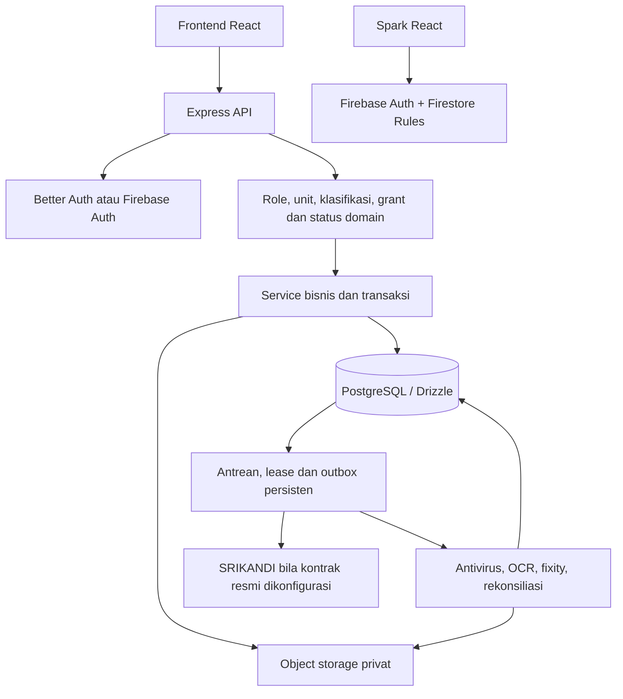
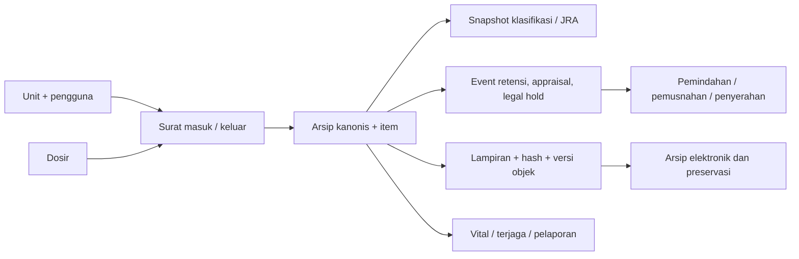
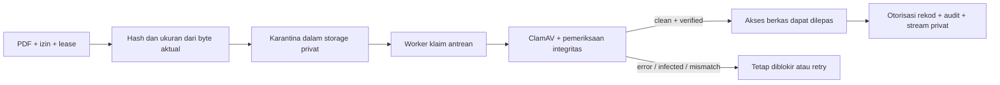

# Analisis menyeluruh proyek SIMSA

Tanggal kajian: 12 September 2026. Sumber: checkout lokal branch `fix/user-readiness`, HEAD `b25b418`. Kajian dilakukan melalui inventaris, pembacaan kode, penelusuran alur, dan pengujian lokal. Dokumen ini membedakan implementasi, bukti pengujian baru, dan informasi deployment yang hanya tercatat dalam dokumentasi.

`PEMETAAN_PROYEK_2026-09-12.md` dan `SECURITY_REVIEW_2026-09-12.md` sudah ada sebagai berkas untracked sebelum kajian ini. Keduanya dipakai sebagai petunjuk dan tidak diubah. Tidak ada source aplikasi, konfigurasi operasional, database, akun, atau deployment yang diubah dalam kajian ini.

## 1. Kesimpulan pemahaman

SIMSA adalah sistem pengelolaan surat dan arsip internal ATR/BPN. Cakupannya melampaui pencatatan surat: pemberkasan, lokasi fisik, peminjaman, kendali akses, versi instrumen klasifikasi/JRA, keputusan retensi, bukti penyusutan, dan pengelolaan berkas digital.

Pusat desainnya adalah **rekod arsip dengan dasar keputusan dan bukti yang dapat ditelusuri**. Status akhir tidak selalu boleh diubah lewat CRUD. Role, unit kerja, klasifikasi keamanan, grant per rekod, pemisahan pelaku, versi aturan, legal hold, dan integritas berkas dapat menentukan sah atau tidaknya suatu operasi.

Repositori memuat dua aplikasi berbeda:

- `frontend/` + `backend/`: SIMSA lengkap, React–Express–PostgreSQL, dengan penyimpanan objek privat bila diaktifkan.
- `spark/`: aplikasi tersendiri berbasis Firebase Auth dan Firestore untuk inventaris metadata/lokasi fisik. Spark tidak menggunakan seluruh service PostgreSQL atau workflow versi lengkap.

Implementasinya cukup luas dan memiliki banyak kontrol domain serta tes. Namun, keberadaan modul tidak berarti modul tersebut aktif dalam deployment tertentu atau sudah menyelesaikan integrasi eksternal.

## 2. Ukuran dan struktur

Inventaris `git ls-files`: **1.244 berkas tracked**, termasuk **887 berkas JS/TS/SQL dengan 169.217 baris**. Angka baris mencakup tests, scripts, konfigurasi, dan SQL; bukan ukuran kode produksi saja. Ada 45 berkas route backend, 74 berkas pada direktori services, dan 40 berkas schema.

| Bagian | Tanggung jawab |
| --- | --- |
| `backend/src/app.ts` | Penyusunan middleware, autentikasi, capability, mount router, error boundary |
| `backend/src/routes/` | Kontrak HTTP, validasi masukan dan pemeriksaan akses awal |
| `backend/src/services/` | Aturan bisnis, transaksi, akses rekod, bukti, integrasi |
| `backend/src/db/schema/` | Model Drizzle dan relasi domain |
| `backend/src/db/migrations/` | Evolusi SQL, constraint, trigger, grants, lifecycle |
| `backend/src/workers/` | Antivirus, OCR, promosi objek GCS, SRIKANDI, fixity, rekonsiliasi |
| `frontend/src/` | UI React, halaman, context, API services, hooks, permission dan capability |
| `spark/` | Edisi Firebase yang terpisah, rules, emulator dan backup drill |
| `scripts/` | Build/runtime, bootstrap Neon, backup, launcher Windows, verifikasi deployment |
| `.github/` dan `deploy/` | CI, release, maintenance, backup dan topologi worker |
| `docs/` dan `docs-site/` | Dokumen teknis/operasional dan panduan pengguna Docusaurus |

Manifest mendeklarasikan Node 24.x, React 19, Vite 7, Tailwind 4, Express 5, TypeScript, Drizzle, PostgreSQL melalui `pg`, Better Auth/Firebase, Zod, Pino, Vitest, Supertest, Testing Library, dan PGlite. Ini adalah versi stack dalam repositori, bukan hasil pemeriksaan versi terbaru di internet.

## 3. Arsitektur dan pilihan runtime

Ada beberapa sumbu konfigurasi yang harus dibedakan:

| Sumbu | Pilihan dan dampaknya |
| --- | --- |
| Mode aplikasi | `full` atau `metadata-demo`; demo mengharuskan database terpisah dan data sintetis |
| Profil | `internal` atau `integrated`; pengiriman SRIKANDI dilarang dalam profil internal |
| Identitas | Better Auth atau Firebase; pengguna tetap harus diprovisikan pada database aplikasi utama |
| Penyimpanan | Disabled, Vercel Blob privat, atau GCS; mode full tetap dapat dipakai untuk metadata ketika storage disabled |
| Antivirus | Worker embedded, external, atau on-demand sesuai validasi environment/platform |
| Modul opsional | Bulk OCR dan advanced archive workflows dapat dinonaktifkan melalui capability |

Referensi: `backend/src/config/demo.ts`, `app-profile.ts`, `cloud-platform.ts`, `malware-scanner.ts`, dan `public-capabilities.ts`.

`/api/capabilities` menerbitkan kontrak kemampuan terbatas. Nilainya berasal dari konfigurasi; endpoint ini tidak membuktikan bahwa provider sedang sehat. `/health` menguji proses HTTP, sedangkan `/ready` dan `/api/health` memeriksa dependensi. Readiness juga memeriksa schema/grant database dan bukti worker; hasil probe digabung dan dicache lima detik (`readiness.service.ts:603`).

`index.ts` memvalidasi environment sebelum mengimpor runtime HTTP. Runtime Windows khusus memvalidasi manifest build, menggunakan origin lokal yang sama, dan menonaktifkan trust proxy karena tidak berada di belakang reverse proxy. Startup tidak menjalankan migrasi atau seed.

**Perintah root mudah tertukar:** `npm start` dan `npm run build` memilih demo metadata. Versi internal memakai `npm run build:internal` serta launcher Windows. Jalur cloud metadata mempunyai build/start tersendiri. Memilih perintah yang tepat merupakan bagian dari kontrak runtime, bukan sekadar kenyamanan.

## 4. Model data dan invariant domain

Diagram ini konseptual, bukan ERD seluruh foreign key.

- Surat masuk dan keluar adalah sumber arsip. Registrasi arsip memutakhirkan sumber, membuat rekod/item, snapshot aturan, dan audit dalam transaksi. Sumber yang sama tidak boleh menghasilkan arsip rangkap.
- `dosir` mengelompokkan surat melalui tabel penghubung; jangan mengasumsikan relasi langsung ke semua rekod arsip.
- Jalur generik `POST /api/arsip` telah ditutup dengan HTTP 410; penghapusan langsung arsip ditolak HTTP 409. Lifecycle terkendali menjadi jalur perubahan domain (`routes/arsip.routes.ts`).
- Klasifikasi/JRA memiliki versi dan workflow aktivasi. Arsip menyimpan snapshot sumber aturan serta hash, bukan hanya membaca master yang dapat berubah.
- Untuk JRA bermode duration, tanggal retensi dihitung dari durasi bulan terstruktur dan event pemicu yang sah. JRA manual atau hasil akhir bersyarat memerlukan appraisal; perhitungan tanggal dan kewenangan penyusutan merupakan keputusan terpisah. Tanggal surat atau label bebas seperti “1 tahun” tidak cukup menjadi dasar keputusan final.
- Event pemicu harus merupakan revisi yang berlaku dan diverifikasi oleh pelaku berbeda. Perubahan dasar aturan/event dapat membuat appraisal lama tidak lagi efektif.
- Legal hold, appraisal terbuka, dan reservasi penyusutan dapat menahan perubahan atau pelaksanaan lifecycle.
- Efek lifecycle juga berada di SQL/trigger, khususnya penyerahan permanen dan bukti penyusutan. Pembacaan service saja tidak mencakup seluruh aturan database.

Titik baca utama: `arsip.service.ts`, `archive-rule-assignment.service.ts`, `regulatory-rule-set.service.ts`, `retention-governance.service.ts`, `penyusutan.service.ts`, serta migrasi `0016`–`0021` dan `0035`–`0038`.

## 5. Alur penggunaan utama

1. Administrator memprovisikan akun, role, dan unit kerja. Akun yang hanya berhasil login belum tentu mempunyai akses domain.
2. Pengguna mencatat surat masuk/keluar, lokasi atau metadata fisik, dan mengunggah PDF jika capability mengizinkan.
3. Surat keluar melewati persetujuan; penomoran server diserialisasi terhadap template unit untuk menghindari benturan nomor.
4. Surat didaftarkan sebagai arsip dengan klasifikasi/JRA aktif dan snapshot aturan. Pemberkasan, lokasi, peminjaman, pencarian dan laporan mendukung kegiatan harian.
5. Event retensi dan appraisal membentuk dasar tindakan berikutnya. Legal hold dapat menahan tindakan.
6. Pemindahan/pemusnahan mengikuti tahapan dan kewenangan yang terpisah. Penyerahan permanen mempunyai manifest/handover/acknowledgement sendiri; mutasi penyerahan melalui batch legacy ditutup.
7. Pemusnahan, penyerahan permanen, preservasi dan pelaporan terjaga mempunyai pemeriksaan lampiran terkendali; beberapa transisi membaca ulang byte serta masa berlaku grant sebelum commit. Bukti event pemicu/appraisal juga dapat berupa URI dan hash yang dicatat dari input untuk ditelaah manusia; jangan menyamakannya dengan verifikasi byte otomatis.

Aktivasi instrumen memisahkan pembuat/pengaju, pemeriksa, dan pemberi persetujuan. **Eksekusi batch pada modul Penyusutan, termasuk pemusnahan, sedikitnya membutuhkan empat akun/pelaku berbeda**: pembuat/pengaju, reviewer, approver super-admin, dan executor super-admin lain (`penyusutan.service.ts:692–728`). Dengan target operasional satu sampai tiga pengguna, alur batch ini membutuhkan pengaturan kewenangan tambahan. Penyerahan permanen berbasis manifest mempunyai workflow sendiri dan tidak otomatis mengikuti hitungan ini. Ini adalah konsekuensi desain yang ada, bukan saran untuk melewati pemisahan tugas.

## 6. Autentikasi dan otorisasi

Urutan otorisasi mencakup identitas/sesi, status aktif pengguna, role yang disetujui, mandat unit, klasifikasi keamanan, grant per rekod, lalu status workflow. Role operasional mencakup `super_admin`, `admin_dirjen`, `admin_sesditjen`, `staff`, dan `auditor`; role `user` adalah status provisioning tanpa akses rekod.

Admin dirjen/sesditjen terikat unit kanonis. Grant `view`, `download`, dan `manage` untuk rekod terkontrol mempunyai pemilik, tujuan, lingkup, masa berlaku, dan pencabutan. Keluasan role tidak otomatis menghapus kebutuhan akses khusus ini. Nilai klasifikasi yang tidak dikenal ditolak.

Backend menjadi penentu izin. UI menggunakannya untuk navigasi dan tindakan, tetapi menyembunyikan tombol bukan pengganti otorisasi API. Sejumlah jalur kritis, termasuk pembaruan arsip, approval, preservasi dan pelaporan terjaga, membaca ulang aktor atau bukti kewenangan dalam transaksi, memakai lock dan pemeriksaan ulang setelah I/O. Pola ini belum seragam pada semua service; beberapa preflight event retensi/appraisal masih dilakukan sebelum transaksi. Sejumlah metode service juga mengandalkan pemanggil untuk scope, sehingga tidak boleh dianggap security boundary mandiri.

Ada pembatasan yang lebih ketat daripada matriks izin umum: endpoint audit hanya mengizinkan super-admin karena seluruh baris audit belum mempunyai dimensi unit yang diwajibkan. Hal ini perlu dipahami agar menu/matriks bukan satu-satunya acuan akses.

Referensi: `config/permissions.ts`, `middlewares/auth.middleware.ts`, `services/record-access.service.ts`, `services/record-access-grant.service.ts`, `utils/authorization-mandate-lock.ts`, dan `routes/audit-log.routes.ts`.

## 7. Berkas digital, antrean dan integritas

Lampiran arsip dibatasi **PDF 10 MiB**, dengan pemeriksaan ekstensi, MIME dan signature `%PDF-` (`config/archive-upload.ts`). Direct upload tetap membutuhkan lease yang cocok dengan pengguna, tujuan, locator dan generasi objek. Metadata klien tidak dipercaya sebagai bukti isi berkas.

Hash, antivirus dan keterikatan lampiran membuktikan aspek teknis berkas. Kontrol tersebut tidak memeriksa keabsahan hukum isi dokumen atau otomatis membuktikan penerimaan oleh ANRI; hal ini juga dibatasi secara eksplisit dalam kode bukti penyusutan/pelaporan terjaga.

`file-release-policy.ts:12` mensyaratkan storage privat, hash SHA-256 valid, hasil antivirus `clean`, dan integritas `verified` sekaligus. Status `clean` sendirian tidak cukup.

Antrean antivirus menggunakan `FOR UPDATE SKIP LOCKED` dan token status untuk menolak hasil worker lama setelah lease berubah (`malware-scan.worker.ts:179`). Pencatatan hasil dan audit dibuat atomik. Jalur on-demand menserialisasi invokasi melalui advisory lock, memeriksa role database worker terpisah, mengerjakan satu percobaan, dan membatasi deadline (`workers/malware-scan-on-demand.ts:38`).

GCS mempertahankan generasi objek dan alur staging/promosi. PostgreSQL dan object storage tidak mempunyai satu transaksi bersama; karena itu proyek memiliki kompensasi, orphan queue, reconciler dan fixity worker. `file-attachment.service.ts:431` juga secara eksplisit mencatat batas kegagalan commit setelah penghapusan objek.

OCR memakai child process dengan environment terbatas, batas memori/deadline, dan kapasitas global melalui lease database. Timeout membunuh proses aktual dan menunggu close sebelum slot dilepas (`ocr-process.service.ts:73–127`). Ini berbeda dari sekadar berhenti menunggu Promise sementara pekerjaan CPU tetap berjalan.

## 8. Frontend dan pengalaman pengguna

Frontend utama mempunyai 45 entri path route dan 40 pemanggilan lazy untuk modul halaman, termasuk SRIKANDI yang kondisional. Context autentikasi dan konfigurasi serta guard sesi, provisioning, role, dan capability menentukan halaman yang tersedia. Halaman mencakup surat, arsip, aturan, retensi, peminjaman, pelaporan, audit, pengguna, dan operasi.

API client menangani cookie sesi, token CSRF, App Check untuk mode Firebase, serta error operasional. Backend menyediakan request ID untuk penelusuran gangguan; API client frontend belum memprosesnya secara khusus. Idle timeout UI adalah 30 menit. Kebijakan sesi backend merupakan kontrol yang berbeda.

Impor CSV mempunyai preview/dry-run dan hasil per baris. Impor Google Sheets publik memakai jalur service terpisah. Bulk upload mempunyai state batch persisten, pemulihan pekerjaan, penanganan respons terlambat dan retry OCR. Batas bulk adalah 50 file/100 MB; bukan perubahan batas satu lampiran arsip 10 MiB.

PWA tidak berarti seluruh arsip dapat dibaca offline. Penyimpanan data arsip offline dan antrean sinkronisasi dinonaktifkan; service worker menggunakan NetworkOnly untuk API. Draft formulir dipertahankan dalam memori. Tes UI memakai jsdom, mock dan sebagian pemeriksaan kontrak source; hasilnya perlu dibedakan dari pengujian browser end-to-end terhadap provider nyata.

Menu 33 formulir menyediakan template referensi kosong; seluruh template tersebut bukan laporan yang otomatis diisi database. Ekspor berbasis data tersedia melalui modul sumber seperti laporan, peminjaman, penyusutan, vital dan terjaga.

## 9. Deployment, Spark dan backup

Repo menyediakan beberapa jalur deployment, sehingga README, manifest build dan konfigurasi runtime harus dibaca bersamaan. Dokumen status produksi 12 September mencatat Vercel–Neon–private Blob dengan antivirus on-demand, serta bulk/OCR, workflow arsip lanjutan dan SRIKANDI dinonaktifkan. **Status cloud itu adalah catatan yang sudah ada; tidak diuji ulang ke layanan nyata pada kajian ini.**

`vercel.json` di akar repo menerbitkan **docs-site**, sedangkan aplikasi utama mempunyai konfigurasi frontend/backend tersendiri. Backend serverless menggunakan handler `backend/api/index.js`, bukan listener `src/index.ts`. Konfigurasi Preview juga dipisahkan dari Production. Jangan memakai direktori root sebagai asumsi target deployment aplikasi.

Spark memakai Firestore Rules sebagai batas akses database. Ia cocok dipahami sebagai pilot inventaris metadata; workflow SQL versi lengkap tidak otomatis berlaku padanya. Backup drill Spark menggunakan emulator; pemulihan metadata akun membuat akun disabled dan tidak mengembalikan kredensial. Keberhasilan drill tersebut bukan bukti backup cloud produksi.

GCP mempunyai pemisahan API, storage events, workers, role database, migrator, maintenance dan backup. Pipeline release mengandalkan artefak bukti migrasi, grant, binding identitas, backup dan restore. Ada 39 entri pada journal Drizzle, terakhir `0038_arsip_direct_upload`.

Backup database berbeda dari backup byte object storage. `docs/STATUS_PRODUKSI.md` mencatat snapshot Neon terenkripsi tetapi `restore_verified=false` dan belum ada salinan di luar workstation. Kajian ini tidak menjalankan backup/restore sumber nyata atau memeriksa ulang cloud.

## 10. Temuan dan batas yang terkonfirmasi dari source

| Prioritas | Temuan | Bukti dan implikasi |
| --- | --- | --- |
| Tinggi untuk rilis GCP | Gerbang maintenance dan preview masih mengharapkan 34 migrasi | `.github/workflows/database-maintenance-gcp.yml:791` dan `database-bootstrap-gcp-preview.yml:688` bertentangan dengan manifest/collector 39 migrasi. Pemeriksaan final terjadi setelah migrasi/converge/seed; job dapat gagal sesudah database berubah dan artefak bukti berikutnya tidak diterbitkan. |
| Sedang | Daftar permohonan akses hanya menjangkau 100 entri per kategori | `frontend/src/pages/RecordAccessGrants.jsx:156–165` mengambil halaman pertama dengan limit 100 dan mengabaikan pagination. Backend menyediakan pagination (`record-access-grant.service.ts:169–248`). Entri ke-101 dan seterusnya untuk daftar sendiri, pending, atau approved tidak dapat dijangkau melalui navigasi layar ini. |
| Sedang | Respons beberapa route meneruskan exception internal | `routes/google-drive-import.routes.ts:70,105` mengirim `error.message`. Global error handler sudah tersanitasi, tetapi catch lokal melewatinya. Dampak informasi yang terungkap bergantung isi exception. |
| Sedang | Pengambilan Google Sheets tidak dibatasi secara memadai | `services/google-drive-import.service.ts:103–108` memakai `fetch` tanpa deadline lalu membaca seluruh body. `maxRows` preview dari route tidak mempunyai batas maksimum. Tidak dilakukan load test atau pembuktian kehabisan memori. |
| Sedang untuk multi-instance | Rate limiter tidak mempunyai store bersama yang dikonfigurasi | `middlewares/rate-limiter.middleware.ts:13–38`. Batas login/API per proses perlu dibedakan dari batas global deployment. |
| Rendah | CSRF membandingkan panjang karakter sebelum panjang byte | `middlewares/csrf.middleware.ts:118–129`; input multibyte dapat membuat buffer berbeda panjang dan `timingSafeEqual` melempar exception. Ini bukan bukti bypass CSRF. |
| Batas fitur | Tanda tangan tersertifikasi belum terimplementasi | `signature.service.ts` mengembalikan 501 untuk signing; belum ada adapter PSrE/BSrE. Verifikasi tidak menyatakan signature mock sebagai valid. |
| Batas fitur | Preservasi eksternal adalah pencatatan kegiatan dan bukti | Sistem tidak otomatis menjalankan seluruh konversi/emulasi yang dicatat. Pemeriksaan integritas merupakan operasi byte yang benar-benar dilakukan. |
| Batas integrasi | SRIKANDI memerlukan kontrak resmi dan aktivasi eksplisit | Terdapat durable outbox/retry/lease; keberadaan kode bukan bukti koneksi produksi atau penerimaan oleh instansi tujuan. |

Validator statis GCP yang dijalankan tetap lulus meskipun angka final 34/39 berbeda. Artinya cakupan validator belum menguji konsistensi angka tersebut; keberhasilan validasi tidak menyangkal temuan source.

Temuan audit lama tentang header HTTP frontend produksi tidak dinyatakan sebagai verifikasi baru di sini karena kajian ini tidak melakukan probe HTTP cloud.

## 11. Kualitas struktur dan arah pemeliharaan

Kekuatan desain adalah pemeriksaan domain yang berlapis, snapshot aturan, audit transaksi, constraint/trigger SQL, karantina berkas, dan test yang menargetkan race/otorisasi/ketidaksesuaian bukti. Pemisahan API dengan worker serta pilihan storage menunjukkan perhatian pada batas proses dan kegagalan provider.

Biaya pemeliharaan paling besar berada pada service dan halaman yang menampung banyak workflow: `regulatory-rule-set.service.ts` 2.233 baris, `retention-governance.service.ts` 1.952, `arsip.service.ts` 1.613, `penyusutan.service.ts` 1.454, `spark/src/App.tsx` 1.579, dan `frontend/src/pages/RegulatoryRuleSets.jsx` 1.306. Besarnya file bukan bukti bug, tetapi membuat perubahan aturan dan review lintas jalur lebih mahal.

Pemisahan yang paling masuk akal mengikuti kemampuan domain: aktivasi instrumen, event retensi, appraisal, penyerahan permanen, dan bukti pelaksanaan. Perubahan perlu menjaga transaksi dan lock yang sekarang menjamin invariant. Memindahkan potongan kode ke banyak helper tanpa memperjelas pemilik aturan tidak cukup mengurangi kerumitan.

Aturan role/capability juga muncul pada router, sidebar dan halaman frontend. Respons service tidak seluruhnya mempunyai bentuk envelope yang seragam. Build frontend memakai Vite tanpa tahap typecheck, sementara TypeScript frontend tidak strict. Ini merupakan area konsistensi kontrak yang layak ditangani setelah kegagalan fungsional dan gate rilis.

Untuk pertumbuhan data, kandidat retensi di `arsip.service.ts:1393` menjadi titik ukur: sebagian hasil dimuat lalu dievaluasi di aplikasi sebelum dipotong dengan `slice`. Pagination UI tidak selalu berarti kueri database mengambil satu halaman saja. Ini belum diukur pada dataset besar, sehingga dicatat sebagai kandidat pengukuran kinerja, bukan klaim latensi produksi.

## 12. Verifikasi pada kajian ini

Pengujian tidak menjalankan migrasi/seed pada database operasional, deployment, atau perubahan akun. Runtime Node 24.21.0 portable dipakai untuk pemeriksaan utama; Node shell default adalah 25.5.0 dan berbeda dari engines proyek.

| Pemeriksaan baru | Hasil |
| --- | --- |
| Backend TypeScript `tsc --noEmit` | Lulus, exit 0 |
| Konfigurasi demo launcher, cloud metadata, dan target Neon | 9/9 lulus |
| Spark native Node scripts: backup archive, emulator doubles, private-file handling | 36/36 lulus |
| Empat validator statis workflow GCP | Lulus, termasuk helper self-tests; tidak menangkap gate 34/39 |
| Backend Vitest penuh, satu worker | Exit 1: 169/172 file lulus; 2.308/2.310 tes lulus, dua assertion gagal dan satu file gagal dimuat; durasi 811,64 detik |
| Frontend Vitest penuh, Node 24, satu worker | Exit 1: 64/65 file lulus; 411/412 tes lulus, satu gagal; durasi 414,68 detik |
| Frontend lint penuh | Dihentikan setelah konsumsi memori sekitar 2,9 GB; tidak dinyatakan lulus |
| Spark typecheck/UI test/build dan emulator | Tidak dijalankan; `spark/node_modules` belum terpasang |

Log pemeriksaan root ada di direktori temporary Windows dengan nama `simsa-study-backend-20260912.*`, `simsa-study-backend-typecheck-20260912.log`, dan `simsa-study-runtime-config-20260912.log`. Log tes skrip Spark: `simsa-spark-study-node-tests.log`.

Tiga masalah backend dapat ditelusuri langsung ke source:

1. `backend/src/__tests__/demo.config.test.ts:38` memakai equality terhadap capability lama tanpa `bulkOcr` dan `advancedArchiveWorkflows`; implementation kini menerbitkan dua field tersebut sebagai `false` pada demo.
2. `backend/src/__tests__/malware-scanner.config.test.ts:114` mengharapkan pesan bahwa Vercel hanya dapat memakai worker external. Validator kini mendukung external atau on-demand, dan tetap menolak embedded. Assertion pesan belum mengikuti kontrak terbaru.
3. `backend/src/routes/__tests__/surat-file-security.routes.test.ts:71` memock `uploadLimiter` tetapi tidak mengekspor `sensitiveLimiter` yang diimpor route sekarang. File gagal saat dimuat, sehingga test di dalamnya tidak masuk hitungan 2.310 assertion yang terkoleksi.

Tidak ada tes dihapus atau diubah untuk menghasilkan status hijau. Kegagalan tersebut berarti suite belum lulus penuh, meskipun akar yang ditemukan adalah kontrak/fixture/mock pengujian. Kegagalan ini sendiri bukan pembuktian bahwa kontrol antivirus atau otorisasi dapat dilewati.

Kegagalan frontend ada pada `frontend/src/components/arsip-elektronik/preservation-evidence.test.jsx:38`: fixture memakai `arsipId='archive-1'`, sedangkan service unggah terbaru memerlukan UUID dan menolak sebelum POST. DOM pengujian menampilkan pesan untuk memilih arsip induk valid. Test juga masih mengharapkan jalur FormData lama. Ini menunjukkan fixture/kontrak tes belum mengikuti perubahan service; tidak membuktikan unggah produksi dengan UUID sah gagal. Log lengkap: `simsa-frontend-study-node24-tests.log`. Peringatan navigasi dokumen jsdom bukan pengujian navigasi browser nyata.

Cakupan kajian adalah peta menyeluruh repositori dan penelusuran mendalam pada alur kritis, bukan klaim bahwa setiap baris dari 887 berkas kode/SQL atau seluruh PDF regulasi telah diaudit satu per satu. Tidak dilakukan browser E2E baru, PostgreSQL integration suite eksternal, pemindaian dependensi live, load test, pentest, verifikasi provider cloud, atau pemulihan backup nyata. Build operasional yang ada tidak ditimpa. Status lulus tes lokal tidak disamakan dengan kesiapan seluruh fitur produksi.

## 13. Titik masuk untuk pekerjaan berikutnya

| Perubahan yang diinginkan | Mulai membaca |
| --- | --- |
| Login, provisioning, Google | `config/auth.ts`, `config/google-oauth.ts`, `middlewares/auth.middleware.ts`, auth context/service frontend |
| Hak akses atau scope unit | `config/permissions.ts`, `record-access.service.ts`, `record-access-grant.service.ts`, mandate lock |
| Surat dan registrasi arsip | route/service surat, `arsip.service.ts`, `archive-rule-assignment.service.ts` |
| Retensi atau penyusutan | service governance/penyusutan **dan** migrasi/trigger terkait |
| PDF, scan atau download | `archive-upload.ts`, file attachment/release policy, malware worker, file-access routes |
| Gangguan operasional | readiness, HTTP metrics, request ID, worker heartbeat dan docs operasional |
| Release/database | journal migrasi, manifest builder, scripts maintenance dan workflow GCP/Vercel |
| Inventaris Firebase | `spark/src/lib/domain.ts`, `repository.ts`, `firestore.rules`, tests emulator |

Urutan tindak lanjut yang paling bernilai: selaraskan gate GCP dan tes yang gagal, perbaiki error handling serta batas impor/CSRF, lalu lengkapi bukti operasional pemulihan dan penerimaan lintas peran. Refactor besar sebaiknya mengikuti kebutuhan perubahan domain yang konkret. Tidak ada perbaikan tersebut diterapkan dalam tugas mempelajari proyek ini.
