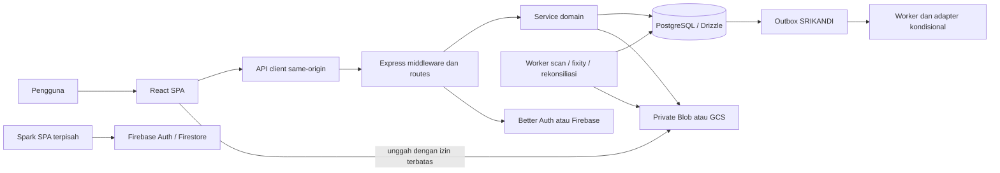
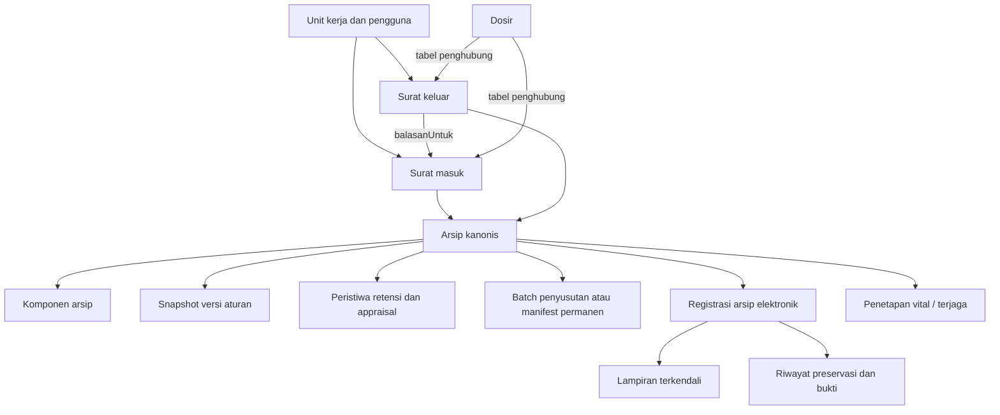

# Peta proyek SIMSA — studi 12 September 2026

## 1. Lingkup dan cara membaca laporan

Kajian ini memetakan produk, frontend, backend, data, kontrol akses, berkas digital, tata kelola arsip, deployment, pengujian, dan Spark. Dasarnya adalah checkout `b25b418a41c88c4a913b148032f8e3dfa4934a69`, branch `fix/user-readiness`, dokumentasi lokal, serta pembacaan implementasi dan tes representatif di seluruh subsistem. Ini bukan klaim bahwa setiap baris telah diaudit atau semua alur telah diuji langsung.

Inventaris Git berisi **1.244 file tracked**. Sebanyak **743 file JS/JSX/TS/TSX/CSS** di `backend/src`, `frontend/src`, dan `spark/src` berjumlah **149.999 baris fisik**, termasuk tes. Ada **40 file schema backend**; angka ini bukan jumlah tabel. Jurnal migrasi kanonis berisi **39 migrasi**, dari `0000` hingga `0038`; folder migrasi memuat 42 SQL karena juga menyimpan berkas tambahan/legacy.

Dokumen `SECURITY_REVIEW_2026-09-12.md` sudah ada sebagai file untracked sebelum studi dan tidak diubah. Source aplikasi, konfigurasi, data, dan deployment tidak diperbaiki dalam tugas ini. Artefak hasil build yang mungkin mulai dihasilkan tidak menjadi bukti build selesai.

Tiga jenis bukti dipisahkan:

- **Kode saat ini:** perilaku yang dapat ditelusuri pada implementasi, schema, dan tes.
- **Bukti terdahulu:** hasil deployment atau pengujian yang dicatat dokumentasi proyek; tidak diuji ulang ke cloud dalam sesi ini.
- **Verifikasi sesi ini:** pembacaan sumber dan pemeriksaan lokal yang benar-benar selesai; percobaan tes yang dihentikan tidak dihitung sebagai lulus.

## 2. Tujuan produk dan batas edisi

SIMSA adalah Sistem Informasi Manajemen Surat dan Arsip untuk pekerjaan internal Ditjen Pengadaan Tanah dan Pengembangan Pertanahan. Cakupannya meliputi surat, pemberkasan, lokasi fisik, pencarian, peminjaman, layanan arsip, klasifikasi/JRA, retensi, legal hold, penyusutan, dan jejak bukti atas dokumen digital.

[Profil aplikasi internal](PROFIL_APLIKASI_INTERNAL.md) memberi konteks produk paling jelas: aturan ATR/BPN dan ANRI merupakan rujukan desain. Keberadaan fitur tidak membuktikan sertifikasi atau pengesahan instrumen. Tanda tangan elektronik BSrE/PSrE berada di luar ruang lingkup produk; service legacy menolak penandatanganan dengan status 501. Konektor SRIKANDI bersifat kondisional.

Repositori memuat **dua aplikasi berbeda**:

| Aplikasi | Data dan identitas | Cakupan |
| --- | --- | --- |
| SIMSA lengkap | PostgreSQL; Better Auth atau Firebase Auth; private object storage bila diaktifkan | Seluruh domain surat dan arsip beserta workflow dan worker |
| SIMSA Spark | Firestore dan Firebase Auth langsung dari klien | Pilot inventaris metadata/lokasi fisik, tanpa Express, PostgreSQL, unggah dokumen, atau seluruh workflow versi lengkap |

`metadata-demo` adalah mode versi lengkap dengan data sintetis. Mode `full` dengan storage `disabled` tetap merupakan aplikasi internal berbasis PostgreSQL yang dapat mengelola metadata; kedua mode itu tidak boleh disamakan. Nilai `full` juga tidak berarti semua modul opsional aktif.

## 3. Arsitektur dan direktori

Versi lengkap berbentuk **monolit modular dengan proses worker terpisah**. API, model data, service domain, dan worker berada dalam satu codebase. Memisahkan proses antivirus/OCR tidak menjadikannya kumpulan microservice independen.



| Lokasi | Peran dan titik masuk |
| --- | --- |
| `frontend/src/main.jsx`, `App.jsx` | Provider, gerbang konfigurasi, routing, layout, lazy loading |
| `frontend/src/pages`, `components`, `hooks` | Halaman bisnis, formulir, kontrol UI, state dan koordinasi request |
| `frontend/src/services`, `lib` | Kontrak HTTP, autentikasi, upload/download, konfigurasi, kebijakan klien |
| `backend/src/index.ts`, `api-runtime.ts`, `app.ts` | Validasi startup, listener/shutdown, middleware dan pemasangan router |
| `backend/src/internal-runtime.ts` | Server lokal same-origin untuk launcher Windows |
| `backend/src/routes`, `validators`, `middlewares` | Validasi input, scope/permission, respons HTTP |
| `backend/src/services` | Aturan bisnis, transaksi, otorisasi ulang, integrasi, pengolahan berkas |
| `backend/src/db/schema`, `migrations`, `grants` | Model relasional, evolusi database, trigger lifecycle dan hak runtime |
| `backend/src/storage`, `workers`, `events` | Adapter Blob/GCS, job terpisah, penerimaan event upload |
| `scripts`, `deploy`, `.github` | Build/profil, launcher, backup, deployment, CI dan gate rilis |
| `docs`, `docs-site` | Runbook/rekaman teknis dan situs panduan Docusaurus berbahasa Indonesia |
| `spark` | Aplikasi pilot mandiri, rules Firestore, repository, emulator, backup |
| `.agent/skills` | Materi kemampuan agen pengembangan; bukan modul runtime aplikasi |
| `output`, hasil CSV/TXT pengujian | Artefak dan bukti lokal; keberadaannya tidak otomatis berarti sesuai checkout terbaru |

Stack yang dideklarasikan: Node 24.x, React 19, React Router 7, Vite 7, Tailwind 4/Radix, Express 5, TypeScript, Drizzle ORM, `pg`, Better Auth, Firebase, Zod, Pino, Vitest, dan PGlite untuk sebagian tes SQL. Versi tersebut berasal dari manifest proyek, bukan pemeriksaan versi terbaru di internet.

## 4. Alur request dan autentikasi

Urutan penting di [app.ts](../backend/src/app.ts): observability/request ID → CORS → Helmet → cookie/CSRF cookie → endpoint health/capabilities → limiter dan handler auth → parsing/sanitasi → CSRF dan App Check → pembatasan mode/storage/modul → limiter umum → router → handler error. Handler Better Auth ditempatkan sebelum JSON body parser.

`/health` hanya liveness proses. `/ready` dan `/api/health` menilai database/skema, storage dan worker yang diperlukan. `/api/capabilities` adalah kontrak ketersediaan konfigurasi fitur, **bukan bukti kesehatan langsung setiap dependensi**. Readiness menggabungkan request bersamaan dan cache lima detik agar probe tidak memperbesar beban provider.

[auth.middleware.ts](../backend/src/middlewares/auth.middleware.ts) memverifikasi identitas lalu membaca pengguna terprovisi dari database. Pengguna nonaktif, role belum terpasang, atau mandat unit belum lengkap ditolak. Jadi sesi valid saja belum memberikan akses ke arsip.

- Better Auth: email/sandi dan Google bila dikonfigurasi, sesi 24 jam dengan pembaruan empat jam. Signup publik sandi dinonaktifkan pada production; signup Google dinonaktifkan. Google hanya menghubungkan identitas dengan akun yang telah diprovisi.
- Firebase: ID token/session cookie diverifikasi, dengan pemeriksaan revocation sesuai konfigurasi. Email verified dan profil aplikasi tetap diperlukan. App Check menjadi sinyal anti-penyalahgunaan, bukan pengganti izin domain.
- Frontend/API production menggunakan origin yang sama. Cookie secure, kebijakan origin dan callback OAuth terkait erat dengan kontrak ini.

### Lapisan otorisasi

1. **Role:** `super_admin`, `admin_dirjen`, `admin_sesditjen`, `staff`, `auditor`; `user` tidak mempunyai akses domain.
2. **Unit:** super-admin lintas unit; admin dirjen/sesditjen terikat unit kanonis; staff/auditor pada unit penugasan.
3. **Klasifikasi:** nilai yang dikenali adalah biasa, terbatas, rahasia, sangat rahasia; nilai tidak dikenal gagal tertutup.
4. **Need-to-know:** kelas terkontrol membutuhkan grant per rekod dengan tujuan, mode `view`/`download`/`manage`, pemilik, scope, masa berlaku dan pencabutan. Bahkan keluasan role tidak otomatis menghilangkan kebutuhan grant ini.
5. **Status domain:** arsip ditahan legal hold/penyusutan atau surat yang sudah dikunci workflow tidak bebas dimutasi.

Pada service governance baru, kewenangan pelaku, parent record, grant, dan status diperiksa lagi di dalam transaksi; row/advisory lock serta pemeriksaan kedaluwarsa setelah I/O mengurangi perubahan izin di tengah operasi. Pola ini belum seragam pada semua modul lama.

Sumber utama: [permissions.ts](../backend/src/config/permissions.ts), [record-access.service.ts](../backend/src/services/record-access.service.ts), [authorization-mandate-lock.ts](../backend/src/utils/authorization-mandate-lock.ts).

## 5. Model data dan hubungan bisnis



Diagram ini menunjukkan hubungan konseptual, bukan ERD semua foreign key. Referensi surat sumber dan attachment menggunakan identitas tipe+ID; integritasnya juga dijaga oleh service dan migrasi khusus.

Hal yang mudah salah dipahami:

- **Dosir mengelompokkan surat**, melalui dua tabel many-to-many; bukan relasi langsung dosir-ke-arsip.
- `arsip` adalah rekod kanonis hasil registrasi, bukan sekadar flag pada surat. Sumber surat dibatasi agar tidak menjadi arsip rangkap dengan kombinasi tipe dan ID sumber yang sama.
- Master klasifikasi/JRA **berversi**. Arsip menyimpan snapshot keputusan sehingga perubahan master tidak diam-diam mengganti dasar retensinya.
- Aturan, event retensi, appraisal, keputusan komponen, dan bukti penyerahan saling terikat; ID yang valid secara terpisah belum tentu sah dipasangkan.
- Sebagian efek akhir penyerahan permanen berada di **trigger SQL**, terutama migrasi `0020_permanent_transfer_lifecycle.sql`. Membaca service saja tidak cukup untuk memahami state akhir.

## 6. Peta fitur dan workflow

| Kelompok | Implementasi inti dan aturan penting |
| --- | --- |
| Surat masuk | Pencatatan, pencarian/filter, lampiran, hubungan balasan, distribusi, pengarsipan, audit |
| Surat keluar | Nomor dialokasikan server dengan mutex template unit; draft/pending/approved/rejected; pemeriksaan pelaku; sumber baru dapat diarsipkan setelah approved |
| Arsip dan lokasi | Metadata, item, snapshot klasifikasi/JRA, lokasi fisik, peminjaman, pencarian dan ekspor |
| Dosir/tunjuk silang | Kelompok surat dan hubungan penelusuran; pembatalan tunjuk silang mempunyai jejak alasan |
| Versi aturan | Draft → submitted → reviewed → approved → active; versi lama superseded; bukti sumber, completeness, diff/impact, dan pemeriksaan hash |
| Retensi | Peristiwa pemicu + bukti + verifikasi independen; kalkulasi kanonis; legal hold; appraisal dan keputusan per komponen |
| Penyusutan | Draft → proposed → reviewed → approved → executed; kelayakan, pemisahan pelaku, bukti final dan audit transaksi |
| Penyerahan permanen | Manifest, reservasi item, handover, acknowledgement, pembatalan sebelum penyerahan; lifecycle berbeda dari batch legacy |
| Arsip elektronik | Registrasi versi pending → verified/rejected; QC metadata digitasi, fixity; verified menjadi immutable |
| Preservasi | Pemeriksaan integritas nyata; pencatatan tindakan eksternal dengan sumber/hasil/bukti, tool/version dan snapshot hash |
| Vital/terjaga | Penetapan khusus dan perlindungan; pelaporan terjaga draft → sent → received → verified/cancelled dengan bukti dan verifier independen |
| Layanan/distribusi | Permintaan akses/layanan, peminjaman, inbox distribusi, status tindak lanjut dan notifikasi |
| Impor/ekspor | CSV dengan preview/dry-run, Google Sheets publik, batch OCR, laporan, formulir cetak, export bounded |
| Administrasi | Pengguna/unit, master, template, preferences, audit log, metrik operasi, grant akses, konfigurasi profil |

### Retensi bukan hitungan sederhana dari tanggal surat

[archive-rule-assignment.service.ts](../backend/src/services/archive-rule-assignment.service.ts) memilih butir aktif, memeriksa identitas kode/versi dan mapping, lalu membentuk snapshot berisi sumber/hash, durasi terstruktur dan guidance. Kalkulasi tidak mengurai angka dari label bebas seperti “1 tahun”.

Registrasi arsip belum otomatis memulai retensi. Event pemicu harus valid, masih merupakan revisi terbaru dan diverifikasi oleh pihak lain. Perubahan snapshot atau event dapat membuat appraisal terdahulu tidak efektif. Arsip `Dinilai Kembali` tidak otomatis boleh dimusnahkan hanya karena tanggal jatuh tempo terlewati. Appraisal terbuka dan legal hold menahan penyusutan.

### Pemisahan pelaku mempunyai konsekuensi operasional

Aktivasi aturan memerlukan tiga akun berwenang yang berbeda. Workflow penyusutan lengkap memisahkan pengaju/pembuat, reviewer, approver, dan executor; pada jalur minimum diperlukan **empat identitas berbeda** jika pembuat sekaligus pengaju. Target penggunaan awal satu–tiga orang yang tercatat di dokumen production belum mencakup kebutuhan personel untuk seluruh lifecycle ini. Penyesuaian operasional harus menjaga pemisahan tugas, bukan memakai akun bersama.

### Batas fitur digital lanjutan

QC memvalidasi metadata seperti DPI/kedalaman warna yang diberikan; itu tidak membuktikan kualitas optik scan secara otomatis. Preservasi migration/conversion/emulation mencatat pekerjaan eksternal dan buktinya, bukan menjalankan transformasi file tersebut. Verifikasi bukti pelaporan tidak menjadi klaim kepatuhan institusional.

Sumber orientasi: [arsip.service.ts](../backend/src/services/arsip.service.ts), [regulatory-rule-set.service.ts](../backend/src/services/regulatory-rule-set.service.ts), [retention-governance.service.ts](../backend/src/services/retention-governance.service.ts), [penyusutan.service.ts](../backend/src/services/penyusutan.service.ts), [preservation-activity.service.ts](../backend/src/services/preservation-activity.service.ts).

## 7. Siklus berkas digital

```mermaid
flowchart LR
  I[Permintaan upload berwenang] --> L[Intent atau lease]
  L --> P[Object privat / area ingest]
  P --> B[Registrasi dan baseline SHA-256]
  B --> Q[Karantina]
  Q --> S[Worker scan dan hitung hash stream]
  S -->|clean dan cocok| R[Released]
  S -->|infected / mismatch / error| Q
  R --> G[Gateway API: izin + status + audit]
  G --> U[Preview atau download]
```



Unggahan lampiran baru dibatasi **PDF 10 MiB**, ekstensi/MIME benar dan magic prefix `%PDF-`. Ukuran tersebut berbeda dari batas download frontend 50 MiB atau batas internal beberapa pemeriksaan legacy; jangan memakai salah satunya sebagai batas semua jalur.

`client-blob-upload.service` mengikat lease ke pengunggah dan tujuan. Finalisasi attachment arsip juga mengikat path ke arsip, menolak pemakaian lease pada parent lain, dan dapat mengenali pengulangan finalisasi yang identik. Pemeriksaan storage ditempatkan di antara transaksi singkat dengan otorisasi ulang setelah I/O pada jalur upload baru.

Pada Vercel Blob, klien mengunggah memakai token terbatas; callback SDK diverifikasi sebelum lease dapat diklaim. Pada GCS, intent/resumable upload dilanjutkan event finalize, pencatatan generation, scan, dan promosi ke objek final. Rekonsiliasi menangani lease terlantar dan objek final yang belum memiliki referensi; efek storage tidak dapat di-rollback oleh PostgreSQL sehingga antrean kompensasi penting.

[file-release-policy.ts](../backend/src/services/file-release-policy.ts) mensyaratkan sekaligus:

```text
storageAccess = private
sha256 = hash 64 digit hex yang valid
malwareScanStatus = clean
integrityStatus = verified
```

Worker menghitung hash dari **stream yang sama dengan yang dipindai**, memeriksa ukuran, baseline dan bukti engine. Runtime scanner mencakup embedded, external, atau on-demand sesuai platform. Native ClamAV memiliki proses terisolasi, batas waktu/memori, definisi bertanda tangan dan kebijakan kegagalan yang mempertahankan karantina. OCR juga berjalan di child process dengan batas dan cancellation, serta ada kapasitas global berbasis database.

[file-access.routes.ts](../backend/src/routes/file-access.routes.ts) memeriksa parent ACL/grant, status release, lalu menulis audit sebelum mengalirkan byte. Respons private/no-store; pembatalan koneksi menutup stream provider. Gateway legacy yang mengalihkan pengguna ke URL objek telah dipensiunkan. Pemeriksaan fixity periodik membaca kembali objek/generation yang tercatat.

## 8. Frontend: state, UX dan kontrak

`main.jsx` menyusun StrictMode, tema, konfigurasi runtime, auth dan aplikasi. `App.jsx` memakai router terpusat; login dimuat langsung dan hampir semua halaman lain lazy-loaded. Layout menyediakan sidebar, breadcrumb, pencarian, toast, status layanan/offline, error boundary dan peringatan idle.

State utama berada di React hooks dan Context; tidak ditemukan Redux/Zustand/TanStack Query sebagai pusat state. [api.js](../frontend/src/services/api.js) membungkus fetch: cookie, CSRF/App Check, normalisasi error, respons JSON/blob/stream, dan satu retry untuk GET/HEAD pada kegagalan jaringan. Mutasi tidak diulang otomatis seperti pembacaan.

`AppConfigProvider` mencocokkan mode/provider/capability dengan backend. Flag memengaruhi menu, router dan komponen; perubahan kebijakan harus diperiksa pada ketiganya. Frontend tidak menggantikan otorisasi backend.

Beberapa pola penting yang sudah ada:

- Formulir surat menjaga perubahan belum disimpan, mengunci submit ganda, memusatkan payload dan fokus error.
- Dashboard memisahkan data inti/widget, menandai data lama ketika refresh gagal, dan menolak respons unit lama yang terlambat.
- Upload menangani callback yang belum selesai dan status scan tertunda; byte PDF diambil melalui API terautentikasi dengan batas stream dan abort.
- Idle warning pada 25 menit dan logout pada 30 menit; kegagalan logout remote ditampilkan agar dapat dicoba lagi.
- PWA menyimpan shell/aset statis. **Data surat/arsip tidak disediakan offline.** Draft formulir hanya di memori tab dan hilang saat refresh/logout; persistence/cache API lama dibersihkan.
- Source menunjukkan skip-link, aria-live, focus management, reduced motion, font lokal, responsive sidebar, dan error/empty/loading states. Tampilan browser belum diverifikasi visual pada sesi ini.

Frontend memiliki 65 file tes. Kontrak API dengan mock, unit scoping, provider/config guard, race request, upload, bounded file stream, CSV preview, unsaved changes, notifikasi dan aksesibilitas tercakup. Tes bernama integration-contracts tetap memakai API mock; itu bukan bukti E2E pada backend hidup. Artefak TestSprite terutama berupa rencana/PRD, bukan bukti tes browser yang baru selesai.

## 9. Integrasi, deployment dan operasi

### SRIKANDI

Producer yang ditemukan menerbitkan event **created** untuk surat masuk/keluar. Tidak ditemukan sinkronisasi dua arah lengkap atau producer update/delete/approval/arsip. Outbox memiliki idempotency key/hash, contract version, lease, retry/backoff, dead letter dan audit atomik. Adapter membatasi timeout/ukuran respons, menolak redirect dan memerlukan ACK/remote ID sesuai konfigurasi. HTTP 2xx saja tidak dianggap sukses sinkronisasi.

### Jalur runtime

| Jalur | Karakter |
| --- | --- |
| Windows internal | `Mulai-SIMSA.cmd` / `Cek-SIMSA.cmd` / `Hentikan-SIMSA.cmd`; same-origin loopback; startup tidak menjalankan migrasi/seed |
| Vercel + Neon + private Blob | Jalur production yang paling baru dicatat; Better Auth dan scanner on-demand; Preview memiliki isolasi konfigurasi |
| Render + Neon | Jalur build/start cloud metadata sudah tersedia; dokumen mencatat layanan Render belum dibuat |
| Firebase/GCP | Firebase Auth, Cloud Run, Cloud SQL, GCS, Eventarc dan worker; Terraform, role/grant, maintenance, backup dan release gate tersedia |
| Demo metadata | Root `npm start` / `npm run build` mengarah ke demo, bukan startup full default |
| Spark | Pilot terpisah; status kesiapan/deploy mengikuti kontrak Spark sendiri |

**Kesalahan operasional yang perlu dihindari:** menganggap root `npm start` adalah cara menjalankan aplikasi penuh atau menganggap README awal tentang Render sebagai status live paling baru.

[STATUS_PRODUKSI.md](STATUS_PRODUKSI.md) mencatat penerimaan production tanggal 12 September: login sandi, surat sintetis, PDF 10 MiB privat, scan dan akses berkas; Google sampai pemilihan akun. Dokumen tersebut juga menyatakan data lama belum diimpor, belum ada klasifikasi/JRA aktif, bulk/OCR dan workflow arsip lanjut belum aktif. **Pernyataan itu adalah bukti terdahulu yang tercatat, bukan hasil probe cloud baru pada studi ini.**

Backup Neon terenkripsi tercatat telah dibuat tetapi `restore_verified=false`, belum offsite, dan backup database tidak meliputi byte di Blob. Artefak restore lokal disposable tidak otomatis membuktikan pemulihan sumber production beserta file. CLI yang dibaca juga membatasi archive PostgreSQL 64 MiB dan evidence 2 MiB; pertumbuhan data memerlukan evaluasi jalur backup. Ini membatasi klaim kesiapan pemulihan bencana.

CI meliputi lint/build/test, pengujian SQL dan peran database pada PostgreSQL 16/17/18, validasi image/deployment/preview, smoke ClamAV, Spark emulator, serta gate maintenance/backup. Pemeriksaan Windows, `scripts/neon-worker.test.mjs` dan `scripts/vercel-node-interop.test.mjs` tidak semuanya dirangkai ke root test/CI; luas tes lokal dan luas gate otomatis berbeda. Threshold audit dependensi docs-site adalah critical, berbeda dari high untuk backend/frontend/Spark; ini kebijakan pipeline yang eksplisit, bukan hasil audit dependensi baru sesi ini.

### Spark secara khusus

[CONTRACT.md](../spark/CONTRACT.md) dan rules membatasi unit, verified-email, akun aktif, serta role `operator`/`viewer`/`admin`. Setiap perubahan record menambah version dan history atomik; archived/history tidak dapat dimutasi klien. Query dibatasi, edit memakai expected version, cache hanya memori dan tidak ada janji sukses offline. Riwayat perubahan itu bukan audit keamanan independen; Admin SDK/IAM mempunyai batas kewenangan lain. Dependensi Spark tidak dipasang dan emulator tidak dijalankan dalam studi ini.

## 10. Risiko konkret pada kode saat ini

Temuan berikut berasal dari penelusuran source, **belum merupakan reproduksi baru terhadap runtime/database production**. Prioritas menunjukkan dampak yang perlu didahulukan, bukan klaim telah dieksploitasi.

### P1 — Hasil mismatch integritas dapat ter-rollback

`backend/src/services/arsip-elektronik.service.ts:341` memanggil `verifyIntegrity(..., tx)` lalu melempar error ketika hash tidak cocok. `file-attachment.service.ts:384` menulis status mismatch dalam transaksi yang sama. Error membatalkan penulisan tersebut. Bila status sebelum pemeriksaan adalah clean/verified, hasil pemeriksaan baru tidak menetap dan predicate release masih dapat membaca status lama; verifikasi versi elektroniknya sendiri tetap gagal.

Pola perbaikan sudah ada di preservasi: commit status mismatch dan audit kegagalan, kembalikan sentinel dari transaksi, lalu tolak operasi di luar transaksi. Tambahkan tes integrasi yang memeriksa keadaan attachment setelah transaksi ditolak, bukan hanya bahwa fungsi melempar error.

### P1 — Link/unlink dosir tidak memakai izin kelola per rekod

`backend/src/routes/dosir.routes.ts:456` dan `:533` memakai izin tulis umum serta scope unit. `dosir.service.ts:371`/`:414` hanya memeriksa surat ID dan unit yang sama sebelum memasang relasi. Grant, klasifikasi terkontrol dan status sumber tidak diperiksa seperti pada jalur mutasi arsip. Penulis satu unit yang mengetahui UUID dapat mengubah hubungan dosir surat yang belum memiliki grant kelola untuknya; ini belum membuktikan pembacaan byte atau bypass lintas unit.

Gunakan pemeriksaan parent/surat dan grant kelola kanonis, pemeriksaan status serta otorisasi ulang dalam transaksi untuk kedua arah relasi. Tes harus mencakup surat terkontrol tanpa grant, grant kedaluwarsa, serta sumber deleted/locked.

### P2 — Surat masuk ditandai sudah dibalas saat balasan masih draft

`backend/src/services/surat-keluar.service.ts:266` mengubah surat masuk menjadi `sudah_dibalas` pada create; default surat keluar adalah draft (`db/schema/surat-keluar.ts:39`). Edit/delete balasan tidak merekonsiliasi status sumber. Akibatnya status balasan dapat bertahan meskipun draft belum approved, berubah hubungan, atau telah dihapus. Tetapkan event bisnis yang dianggap “dibalas” dan turunkan status dari balasan efektif yang masih berlaku.

### P2 — Penomoran dosir tidak atomik

`dosir.routes.ts:295` mengambil kode sebelum insert. `dosir.service.ts:541` membaca urutan string tertinggi lalu menambah satu; `db/schema/dosir.ts:14` tidak memberi unique constraint pada kode. Dua create bersamaan dapat menghasilkan kode sama. Pengurutan leksikografis juga bermasalah setelah tiga digit. Gunakan counter numerik/mutex dan uniqueness per scope sesuai aturan penomoran, beserta tes konkurensi.

### P2 — Respons notifikasi lama dapat menimpa scope baru

`frontend/src/hooks/useNotifications.js:80` menulis hasil request tanpa generation/abort guard seperti Dashboard. Respons unit lama yang selesai terlambat dapat menimpa state setelah super-admin berpindah unit atau notifikasi dinonaktifkan. Ini risiko konsistensi UI, bukan bukti otorisasi backend gagal. Gunakan generation token atau cancellation dan uji urutan respons terbalik.

### Batas kontrol dan perawatan

- Pemeriksaan bukti handover/ACK permanen mengecek metadata released dan keberadaan timestamp fixity; tidak semua jalur membaca ulang byte atau membatasi usia fixity. Kebijakan kesegaran bukti perlu dinyatakan sebelum disimpulkan sebagai bug.
- ESLint frontend memilih JS/JSX; UI TS/TSX tidak tercakup konfigurasi itu. Tidak ada script typecheck frontend, dan `strict:false`. Lint hijau tidak membuktikan seluruh type surface diperiksa.
- Service aturan 2.233 baris, governance retensi 1.952, arsip 1.613, penyusutan 1.454; halaman versi aturan 1.306 dan detail arsip 1.153. Pemisahan menurut sub-workflow akan membantu perubahan terarah, terutama dengan kontrak state/bukti yang kompleks.

### Temuan keamanan terdahulu yang masih sesuai source

[SECURITY_REVIEW_2026-09-12.md](SECURITY_REVIEW_2026-09-12.md) telah mencatat header keamanan HTML frontend Vercel, limiter in-memory antar-instance, penerusan `error.message`, impor Sheets tanpa pembatasan fetch memadai, dan perbandingan CSRF karakter-vs-byte. Pembacaan ulang source masih menemukan pola limiter tanpa shared store, error mentah pada route impor/upload, fetch Sheets tanpa deadline/batas byte, serta perbandingan panjang karakter sebelum `timingSafeEqual`. Hasil HTTP production dan reproduksi pada laporan tersebut tidak diulang di sini.

## 11. Pengujian dan hasil verifikasi sesi ini

Backend menyediakan unit/route tests, tes integrasi PGlite untuk migrasi/domain, dan konfigurasi PostgreSQL terpisah yang memerlukan `TEST_POSTGRES_URL`. PGlite berguna untuk SQL/transaksi tetapi tidak menggantikan seluruh bukti konkurensi, role, storage dan deployment PostgreSQL nyata. Frontend menggunakan Vitest/jsdom/Testing Library.

| Pemeriksaan | Hasil sesi ini |
| --- | --- |
| Inventaris Git, source, schema, routes, service, worker dan kontrak | Selesai; peta dan temuan di atas |
| Validator workflow GCP | Empat validator lulus; self-test gate release/maintenance/binding lulus menurut hasil agen pemeriksa |
| Helper PostgreSQL image / restore-role aliases | 10 tes image dan 15 tes aliases lulus |
| Suite Node scripts dan Spark backup scripts serial | 67 tes lulus teramati, tanpa assertion gagal yang terlihat; suite dihentikan sebelum selesai dan tidak dinyatakan lulus keseluruhan |
| Backend Vitest penuh dan TypeScript `--noEmit` | Dimulai, kemudian dihentikan akibat keterbatasan memori host; tanpa verdict lengkap |
| Frontend Vitest, lint dan build | Dimulai; tes awal memunculkan timeout saat beban tinggi. Percobaan Node 24 dengan dua worker serta lint/build dihentikan; tanpa verdict lengkap |
| Spark build/rules emulator, docs-site build, E2E browser | Tidak dijalankan pada studi ini |
| Live cloud, migrasi/seed, restore production | Tidak dijalankan pada studi ini |

Shell default memakai Node **25.5.0**, berbeda dari engines proyek. Portable Node **24.21.0** tersedia di `output/local-runtime/node-v24.21.0-win-x64/node.exe` dan dipakai pemeriksaan ringan/percobaan ulang frontend. Ketika beberapa validasi berat berjalan, host hanya memiliki sekitar **226 MiB RAM fisik bebas** dan sekitar **496 MiB memori virtual bebas**, dengan 175 proses Node termasuk proses yang telah ada sebelumnya. Proses pemeriksaan milik studi dihentikan; proses pengguna lain tidak dibersihkan. Exit karena penghentian ini tidak menunjukkan kesalahan kompilasi aplikasi.

Dua masalah tes lama juga masih terlihat pada source: mock `surat-file-security.routes.test.ts:71` tidak menyediakan `sensitiveLimiter`, dan ekspektasi regex `malware-scanner.config.test.ts:114` hanya menyebut external meskipun runtime Vercel kini menerima external/on-demand. Ini perlu diselaraskan sambil mempertahankan assertion keamanan; keberadaannya tidak menjadi alasan mengabaikan kegagalan suite lain.

## 12. Panduan pengembangan berikutnya

| Jika mengubah… | Baca dan uji bersama |
| --- | --- |
| Role/unit/akses | permissions, auth middleware, record-access/grants, lock mandat, router/sidebar dan unit-scope tests |
| Surat/nomor/balasan | routes + service surat, numbering/template, approval, attachment lease, audit, outbox, formulir/payload frontend |
| Retensi/JRA | versi aturan, snapshot assignment, event/verifikasi, appraisal, trigger SQL dan kandidat penyusutan |
| File/antivirus | upload config, intent/lease, attachment, release predicate, scanner evidence, worker CAS, gateway dan rekonsiliasi |
| Deployment | manifest frontend, auth origin, env validation, provider/storage flags, worker runtime, Preview isolation dan readiness |
| Backup | role/grants, database snapshot, object inventory/byte, kunci, offsite dan restore terhadap sumber yang sama |

Prioritas yang paling bernilai: perbaiki persistence mismatch dan izin dosir; rapikan transisi balasan serta penomoran; jalankan kembali suite secara serial pada Node 24 ketika memori tersedia; selesaikan bukti restore/offsite dan provisioning aturan/akun sebelum memperluas penggunaan arsip penuh. Sesudah itu, konsolidasikan jalur dokumentasi masuk dan pecah modul besar menurut workflow tanpa mengubah kontrol bisnisnya.

Invarian yang harus dipertahankan: identitas bukan izin; setiap akses tetap terikat unit/rekod; file tidak dilepas sebelum clean+verified+private; audit mutasi kritis atomik; retensi bersumber dari snapshot dan event terverifikasi; legal hold dan pemisahan pelaku tidak dilewati; keberhasilan integrasi menuntut bukti penerimaan; backup baru bernilai operasional setelah pemulihan dibuktikan.
