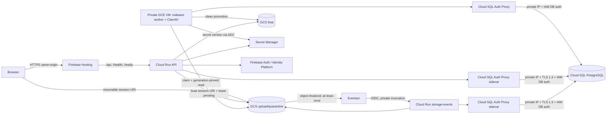

# Blueprint Backend SIMSA pada Firebase dan Google Cloud

Status dokumen ini adalah **target architecture dan contoh IaC untuk review**.
Tidak ada resource yang diprovisikan oleh perubahan ini. Seluruh contoh berada
di bawah `docs/infra/firebase-gcp`, tidak memuat payload secret, dan tidak boleh
dijalankan ke Production tanpa review plan, backup terverifikasi, serta
persetujuan change window.

## Ruang lingkup

Blueprint ini mencakup:

- satu project Firebase/GCP terpisah untuk setiap lingkungan `preview`,
  `staging`, dan `production`;
- Firebase Hosting sebagai origin frontend dan reverse proxy same-origin ke
  Cloud Run API;
- Firebase Authentication/Identity Platform, diverifikasi server-side dengan
  Firebase Admin SDK dan Application Default Credentials;
- Cloud Run API publik pada lapisan IAM agar dapat dipanggil Firebase Hosting,
  tetapi seluruh route bisnis tetap dilindungi sesi, CSRF, App Check, otorisasi
  unit, dan audit aplikasi;
- Cloud Run event receiver privat yang hanya dapat dipanggil service account
  Eventarc;
- Cloud SQL for PostgreSQL private-IP, HA untuk Staging/Production, PITR,
  automated backup, deletion protection, dan automatic IAM database
  authentication melalui sidecar Cloud SQL Auth Proxy;
- dua bucket Cloud Storage privat: `upload/quarantine` dan `final`, dengan
  uniform bucket-level access, public access prevention, versioning, soft
  delete, dan precondition object generation;
- direct resumable upload yang dimulai API, event `object.finalized` melalui
  Eventarc, validasi idempotent berdasarkan `(bucket, object, generation)`, lalu
  pemindahan terkendali ke bucket final setelah hasil antivirus bersih;
- satu VM Compute Engine private untuk ClamAV, malware worker, dan timer
  rekonsiliasi exact-generation, dengan persistent signature disk, Cloud SQL
  Auth Proxy, Shielded VM, Cloud NAT outbound-only, serta IAP/OS Login;
- service account per workload, secret-level IAM, dan Secret Manager tanpa
  service-account key JSON; dan
- contoh rewrite Firebase Hosting dan pemetaan multi-project.

Tanda tangan elektronik **BSrE/PSrE tidak termasuk ruang lingkup** dan tidak
dibuatkan resource, secret, route, callback, atau IAM. SRIKANDI tetap nonaktif
secara default dan hanya boleh diaktifkan melalui desain/kontrak resmi yang
terpisah.

## Arsitektur target



Eventarc bersifat at-least-once. Event receiver tidak boleh menganggap satu
event hanya datang sekali. Receiver wajib:

1. memverifikasi bucket, object name, content type, ukuran, metadata upload ID,
   dan generation terhadap lease database;
2. melakukan upsert idempotent dengan unique key
   `(bucket, object_name, generation)`;
3. mengabaikan duplicate yang sudah selesai dan menolak generation yang berbeda
   dari lease;
4. mempertahankan status `pending/quarantined` selama antivirus belum
   menghasilkan `clean`;
5. menyalin ke bucket final dengan destination precondition
   `ifGenerationMatch=0`; dan
6. mengubah lease/claim dan locator final dalam satu transaksi database sebelum
   object upload boleh dihapus oleh reconciler.

## Isolasi lingkungan

<!-- markdownlint-disable MD013 -->

| Lingkungan | Project Firebase/GCP      | Database                   | Bucket upload/final      | Hosting                                                               | Kebijakan resource                                       |
| ---------- | ------------------------- | -------------------------- | ------------------------ | --------------------------------------------------------------------- | -------------------------------------------------------- |
| Preview    | project khusus Preview    | instance khusus Preview    | bucket khusus Preview    | live channel stabil untuk E2E; preview channel hanya pada project ini | biaya rendah, ZONAL, dapat dibersihkan terkontrol        |
| Staging    | project khusus Staging    | instance khusus Staging    | bucket khusus Staging    | site Staging                                                          | HA dan deletion protection aktif                         |
| Production | project khusus Production | instance khusus Production | bucket khusus Production | custom domain Production                                              | HA, deletion protection, retensi, backup, dan PITR aktif |

<!-- markdownlint-enable MD013 -->

Jangan memakai Firebase Hosting Preview Channel pada project Production: preview
URL bersifat publik dan menggunakan resource project nyata. Untuk direct upload
E2E, gunakan origin Preview stabil yang tercantum exact pada CORS bucket. Bila
CI membuat channel per-PR, pipeline harus menambahkan URL exact channel hanya
pada bucket Preview dan membersihkannya saat channel kedaluwarsa; jangan gunakan
wildcard origin.

Project sudah harus dibuat, ditautkan ke billing, dan diaktifkan sebagai
Firebase project melalui proses organisasi. Contoh Terraform sengaja **tidak**
membuat project, billing account, organization policy, Firebase Auth provider,
DNS, atau custom domain karena semuanya membutuhkan keputusan organisasi dan hak
yang lebih luas.

## Keputusan keamanan utama

- Runtime memakai service account terpisah. Tidak ada
  `google_service_account_key` dan tidak ada file kredensial JSON.
- Build frontend membiarkan `VITE_API_URL` kosong sehingga browser memakai
  origin Hosting yang sama. Variabel Vercel `API_PROXY_ORIGIN`, Automation
  Bypass, dan callback Blob tidak dipakai pada target ini; callback upload
  digantikan Cloud Storage event yang terautentikasi melalui Eventarc. Firebase
  Hosting hanya meneruskan cookie sesi bernama `__session` ke backend dinamis.
- Secret Manager hanya dikelola sebagai container dan IAM. Payload secret
  ditambahkan out-of-band oleh operator/CI beridentitas federasi, tidak pernah
  melalui variable atau state Terraform.
- API Cloud Run diberi `roles/run.invoker` kepada `allUsers` karena Firebase
  Hosting rewrite membutuhkan backend yang dapat dijangkau. Ini bukan anonymous
  business access: middleware sesi Firebase, CSRF, App Check, RBAC/unit
  isolation, rate limit, dan audit tetap wajib. Jika organization policy
  melarang `allUsers`, gunakan external Application Load Balancer/API Gateway
  yang terotorisasi; Firebase Hosting rewrite langsung bukan pola yang cocok.
- Event receiver menggunakan `INGRESS_TRAFFIC_INTERNAL_ONLY` dan hanya service
  account trigger Eventarc yang memiliki `roles/run.invoker`.
- Cloud SQL tidak memiliki public IPv4. Sidecar Cloud SQL Auth Proxy v2 memakai
  `--private-ip` dan `--auto-iam-authn`; koneksi proxy-ke-database dienkripsi
  dan token IAM berumur pendek. Account runtime tetap harus diberi role
  PostgreSQL least-privilege melalui bootstrap SQL terkontrol.
- VM worker tidak memiliki `access_config`/public IP. IAP adalah satu-satunya
  jalur SSH, OS Login/2FA menggantikan metadata SSH key, dan operator kosong
  secara default. Cloud NAT hanya memberi egress untuk FreshClam dan pull image.
  ClamAV diblok dari metadata server; worker dan proxy memakai ADC VM tanpa
  service-account JSON key.
- Upload dan final bucket mengaktifkan uniform bucket-level access serta public
  access prevention. Signed/resumable session URI tetap bearer credential
  berumur terbatas; jangan dicatat di log, analytics, atau error tracking.
- API hanya dapat create/get/delete pada bucket upload dan create/get pada
  bucket final; tidak ada bucket-get, object list/update, atau final delete.
  Readiness memakai `buckets.testIamPermissions` yang non-mutating untuk
  membuktikan permission wajib sekaligus menolak grant berlebih pada kedua
  bucket. Metadata objek harus ditetapkan pada create/copy awal, bukan melalui
  update setelahnya.
- Bucket final tidak memiliki CORS. Download harus melalui file gateway API
  dengan pemeriksaan hak, audit, `Cache-Control: private, no-store`, serta
  checksum.
- Semua image Cloud Run, worker, ClamAV, dan Cloud SQL Auth Proxy wajib berupa
  digest immutable `@sha256:...`, bukan tag seperti `latest`.

## Struktur contoh

```text
docs/infra/firebase-gcp/
├── README.md
├── firebase/
│   ├── .firebaserc.example
│   ├── firebase.preview.json.example
│   └── firebase.production.json.example
└── terraform/
    ├── versions.tf
    ├── variables.tf
    ├── locals.tf
    ├── services.tf
    ├── network.tf
    ├── service-accounts.tf
    ├── database.tf
    ├── storage.tf
    ├── secrets.tf
    ├── cloud-run.tf
    ├── worker.tf
    ├── eventarc.tf
    ├── outputs.tf
    ├── backend.hcl.example
    └── environments/
        ├── preview.example.tfvars
        ├── staging.example.tfvars
        └── production.example.tfvars
```

## Urutan bootstrap dan convergence

Jangan melakukan `terraform apply` langsung dari contoh. Setelah review dan
penyesuaian organisasi:

1. Siapkan remote state terenkripsi dan versioned pada project administrasi
   terpisah. Gunakan prefix unik per lingkungan dan Workload Identity Federation
   untuk CI.
2. Salin satu file `*.example.tfvars` menjadi file lokal/secret-managed yang
   tidak masuk Git. Ganti project ID, origin, tier, kapasitas, dan seluruh image
   dengan digest nyata dari artifact yang sudah lolos CI.
3. Jalankan `terraform fmt -check -recursive`, `terraform init -backend=false`,
   `terraform validate`, lalu `terraform plan -refresh=false`. Review JSON plan
   dengan policy-as-code sebelum backend remote diaktifkan.
4. Pada perubahan berizin, buat dulu API, network, service account, database,
   bucket, dan **container** secret. Jangan membuat secret version melalui
   Terraform.
5. Tambahkan versi `firebase-session-csrf` out-of-band; catat version number
   non-rahasia pada tfvars. Nilai harus acak minimal 32 karakter.
6. Bake image host worker exact (bukan family) dari source yang direview. Image
   harus memasang bundle `deploy/workers` di `/opt/simsa-workers`, Docker
   Compose, gcloud, Python, iptables, dan e2fsprogs—tanpa `.env`, token, atau key.
   Publikasikan worker container ke Artifact Registry dengan digest immutable.
7. Tambahkan payload `.env.gcp.secret.example` sebagai versi secret
   `simsa-worker-environment` di luar Terraform, lalu pin version number pada
   tfvars. Terraform state hanya boleh mengetahui ID dan nomor versi.
8. Setelah Terraform membuat SQL IAM user, lakukan ceremony satu kali pada
   `GCP_DATABASE_MAINTENANCE.md` untuk memberi hanya grant-admin dedicated
   `CREATEROLE` dan ownership aplikasi awal. Migrator tetap tanpa
   `CREATEROLE`; bootstrap hanya memberinya database `CREATE` sementara dan
   mencabutnya kembali setelah migration. Berikan runtime API
   dan event receiver hanya `CONNECT`, `USAGE`, serta DML/sequence yang
   dibutuhkan; jangan berikan schema-owner atau migration DDL kepada runtime.
   Identitas IAM database VM dipakai bersama oleh malware worker dan timer
   reconciler, sehingga grant-nya adalah union terbatas: DML pada
   `file_attachments`, `client_blob_uploads`, `surat_masuk`, `surat_keluar`,
   `regulatory_rule_sets`, `operational_heartbeats`, `bulk_upload_batches`, dan
   `bulk_upload_items`; `INSERT` pada `audit_log`; serta read-only pada
   `ocr_processing_leases`. Detail operasi per tabel ada pada
   `deploy/workers/README.md`; identitas ini tetap tidak boleh menjalankan DDL.
   Terraform juga membatasi runtime API Firebase Auth ke `configs.get` untuk
   probe readiness non-mutating, `users.get`,
   `users.createSession`, `users.update`, serta `users.create/users.delete` yang
   benar-benar dipakai alur user-management dan kompensasi transaksinya;
   perubahan konfigurasi/provider tetap memakai principal operasi terpisah. Event receiver
   hanya memiliki `storage.objects.delete` pada bucket upload untuk menolak
   exact generation yang invalid, dan tidak memiliki akses bucket final.
9. Sebelum mengganti provider login, jalankan migrasi identitas dalam image
   backend yang sama. `npm run identity:firebase:plan` wajib menghasilkan hanya
   pasangan email terverifikasi dan tidak ambigu. Untuk apply, set
   `FIREBASE_IDENTITY_MIGRATION_CONFIRM` persis ke project ID target lalu
   jalankan `npm run identity:firebase:apply` dengan principal operasi khusus.
   Simpan ringkasan dan audit database, hapus variabel konfirmasi setelahnya,
   dan jangan mengubah UUID pengguna/domain yang sudah ada.
10. Untuk database Preview baru, gunakan workflow Preview-only dan petunjuk di
   `GCP_PREVIEW_DATABASE.md`; workflow tersebut membuktikan label Cloud SQL
   `environment=preview`, private IP, exact reviewed merge SHA, dan identitas
   WIF terpisah sebelum mutation pertama. Untuk Production gunakan workflow dan
   ceremony di `GCP_DATABASE_MAINTENANCE.md`. Build target
   `maintenance` harus berasal dari commit yang sama dengan image API. Setelah
   backup `pre_migration` dan independent restore lulus, runner VPC memakai
   Cloud SQL Auth Proxy `--private-ip --auto-iam-authn` dan identitas WIF
   terpisah untuk urutan bootstrap awal -> `npm run db:migrate` -> bootstrap
   final (mencabut database `CREATE` migrator) ->
   `npm run db:grants:converge` -> `npm run seed:all` -> evidence read-only.
   Simpan image/artifact digest, commit, exact journal/ACL/seed, waktu,
   approval, dan operator. Target maintenance tidak menerima traffic dan
   principal runtime tidak memperoleh DDL. Jangan gunakan `db:push` pada
   database terkelola.
11. Deploy revision Cloud Run dengan `--no-traffic`, uji `/health` dan `/ready`
   pada tagged revision, lalu geser traffic bertahap. Setelah promotion
   berhasil, samakan digest tfvars agar Terraform kembali converged.
12. Buat Eventarc trigger hanya setelah endpoint event lulus contract test
   duplicate/out-of-order dan IAM invocation test.
13. Deploy Hosting Preview/Staging dengan config yang memakai `pinTag`;
   Production tidak memakai `pinTag` agar rollout traffic Cloud Run tetap
   menjadi source of truth. Salin contoh yang dipilih menjadi `firebase.json`
   pada root project atau sesuaikan `public` path sebelum menjalankan Firebase
   CLI; file contoh tidak dideploy langsung oleh blueprint ini.

Jangan mengaktifkan `AUTH_PROVIDER=firebase` dan `OBJECT_STORAGE_PROVIDER=gcs`
pada Production sebelum build frontend yang sama sudah memakai Firebase Web
Auth, App Check, pertukaran ID token ke cookie `__session`, CSRF, dan resumable
GCS upload. Buktikan alur login, refresh/revoke, unggah, Eventarc duplicate,
scan generation-pinned, claim transaksi, akses file final, serta rollback di
project Preview yang terisolasi terlebih dahulu.

Cloud Run/Firebase deployment, secret population, database grant, migration,
DNS, dan apply Terraform tidak dijalankan oleh perubahan dokumentasi ini.

## Kontrol organisasi di luar contoh Terraform

Beberapa kontrol sengaja tidak dikelola root module ini karena sifatnya
organization-wide atau membutuhkan penerima notifikasi/retensi yang disahkan.
Semuanya tetap menjadi gerbang Production:

- organization policy untuk menolak pembuatan service-account key, membatasi
  lokasi resource, mewajibkan uniform bucket-level access/public access
  prevention, dan mengatur domain-restricted sharing;
- Firebase Auth provider, authorized domain, MFA/Identity Platform blocking
  policy, template email, dan akun break-glass; serta registrasi Firebase Web
  App ke App Check dengan key reCAPTCHA Enterprise yang tepat untuk setiap
  environment. Isi `firebase_app_check_app_ids` hanya dengan exact Web App ID
  environment tersebut; API menolak token dari app lain. Pertukaran session,
  revokasi global, dan pembuatan sesi direct-upload wajib memakai limited-use
  token yang dikonsumsi server agar replay ditolak. API App Check dan reCAPTCHA
  Enterprise sudah di-enable oleh Terraform, tetapi registrasi/key dan
  enforcement tetap harus dibuktikan;
- Data Access audit logs serta aggregated log sink ke project keamanan yang
  operator aplikasi tidak dapat ubah;
- Cloud Monitoring uptime check, SLO/error-budget, alert 5xx/latency, kapasitas
  Cloud SQL, Eventarc retry/backlog, object quarantine terlalu lama, backup,
  restore, dan certificate expiry beserta notification channel yang diuji;
- VPC Service Controls atau kontrol exfiltration lain berdasarkan klasifikasi
  data dan kebijakan organisasi; dan
- salinan backup GCS/database lintas project/account dengan retensi immutable.
  Versioning, soft delete, automated backup Cloud SQL, dan PITR pada project
  utama bukan pengganti backup independen atau restore drill.

Audit config project-level bersifat authoritative dan dapat menimpa kebijakan
yang sudah dikelola organisasi, sehingga tidak aman dimasukkan sebagai contoh
generik. Tim platform harus menyimpan bukti konfigurasi dan uji notifikasi
bersama artifact release.

## Kontrak runtime minimum

Image API wajib:

- mendengarkan `PORT=8080` pada `0.0.0.0`;
- memiliki `/health` untuk liveness tanpa dependency remote dan `/ready` untuk
  kontrak schema/grant database, effective IAM kedua bucket, heartbeat worker,
  serta akses read-only konfigurasi Firebase Auth;
- membaca Firebase Admin melalui ADC, bukan service-account key;
- menerima database pada `DB_HOST=127.0.0.1`, `DB_PORT=5432`,
  `DB_USER=<service-account tanpa .gserviceaccount.com>`, dan password kosong
  karena proxy melakukan automatic IAM auth. Runtime GCP menolak
  `DATABASE_URL`, host non-loopback, Unix socket dari project lain, password
  statis, dan principal IAM database yang bukan milik project environment; dan
- gagal tertutup bila `FIREBASE_SESSION_CSRF_SECRET`, bucket, Firebase project,
  atau database tidak siap.

Image event receiver wajib memiliki kontrak probe yang sama, menerima
CloudEvents pada `POST /internal/events/storage-finalized`, dan menolak request
tanpa identitas Eventarc/IAM. Route ini tidak boleh dipasang pada service API
publik. Docker image backend yang sama dapat dipakai, tetapi service event wajib
mengganti command menjadi `node dist/events/storage-finalized.js` seperti contoh
Terraform.

Contoh IaC menetapkan `APP_PROFILE=internal`, `SRIKANDI_ENABLED=false`, serta API
`MALWARE_SCANNER_MODE=clamav` dengan runtime worker `external`. API tidak
menghubungi clamd; `/ready` membaca heartbeat durable dari VM worker. Production
**belum boleh membuka download/preview file** sampai drill clean, EICAR,
failure, container/VM restart, heartbeat, persistent signature disk, recovery
queue, dan exact-generation source cleanup lulus sesuai
`deploy/workers/README.md`.

## Gerbang penerimaan

- Project, database, bucket, service account, secret, dan state benar-benar
  terpisah untuk ketiga lingkungan.
- `terraform plan` tidak membuat service-account key, secret version, public
  bucket, public database IP, wildcard CORS, atau resource BSrE/PSrE.
- API direct Cloud Run tidak dapat mengakses route bisnis tanpa sesi/CSRF/App
  Check meskipun IAM invoker publik.
- Event service direct public menghasilkan 403; event bertanda tangan dari
  Eventarc diterima.
- Direct upload membuat lease `pending`, upload selesai memicu event, duplicate
  event tidak membuat claim ganda, generation mismatch ditolak, dan object final
  hanya tersedia setelah hasil antivirus `clean`.
- VM worker tidak memiliki public IP; IAP/OS Login diuji, ClamAV tidak dapat
  mengambil metadata token, worker/proxy dapat memakai ADC, dan reboot VM tetap
  memakai signature PD serta digest container yang sama.
- Timer reconciler menghapus hanya generation upload yang berstatus cleanup;
  role worker tidak memiliki object list atau final-bucket delete.
- Backup/PITR Cloud SQL aktif; restore drill ke instance/project terisolasi
  membuktikan schema, data, constraint, audit, dan pasangan object database–GCS.
- Signed/resumable URI tidak muncul pada Cloud Logging, trace, analytics, atau
  client error telemetry.
- Rollback backend menggunakan revision digest sebelumnya dan traffic migration;
  rollback Hosting menggunakan release sebelumnya; rollback database menggunakan
  strategi forward-fix atau restore yang telah diuji, bukan `db:push`.

## Keterbatasan yang harus disadari

- Firebase Hosting mempunyai timeout rewrite 60 detik. Pekerjaan OCR, antivirus,
  export besar, dan rekonsiliasi harus asynchronous.
- `pinTag` memakai Cloud Run tags dengan kuota terbatas; gunakan hanya
  Preview/Staging dan bersihkan channel lama.
- Firebase Auth memproses data pada lokasi yang didokumentasikan Firebase;
  pilihan region Cloud Run/SQL/Storage tidak mengubah lokasi layanan Auth.
- Event Cloud Storage untuk Eventarc harus berada pada project dan location yang
  cocok dan dikirim at-least-once melalui Pub/Sub.
- Direct VPC egress mengonsumsi alamat pada subnet; pantau utilisasi dan quota
  sebelum menaikkan max instances.
- Secret Manager regional secret tidak didukung oleh integrasi native Cloud Run.
  Contoh memakai secret global dengan user-managed replica di region yang
  dipilih.
- VM tunggal adalah titik kegagalan yang diterima untuk baseline biaya rendah.
  Automatic restart dan PD terpisah mempercepat recovery tetapi bukan HA; selama
  VM/zone gagal, scan berhenti dan readiness harus fail-closed. `e2-micro` dan
  mesin kecil sekelasnya tidak cukup untuk batas memori ClamAV.

## Referensi resmi

- [Firebase Hosting ke Cloud Run, `pinTag`, dan timeout 60 detik](https://firebase.google.com/docs/hosting/cloud-run)
- [Firebase Hosting Preview Channels](https://firebase.google.com/docs/hosting/test-preview-deploy)
- [Lokasi pemrosesan dan penyimpanan Firebase](https://firebase.google.com/support/privacy/)
- [Cloud Run multi-container dan startup order](https://cloud.google.com/run/docs/configuring/services/containers)
- [Cloud SQL dari Cloud Run](https://cloud.google.com/sql/docs/postgres/connect-run)
- [Automatic IAM database authentication](https://cloud.google.com/sql/docs/postgres/iam-logins)
- [Cloud SQL Auth Proxy](https://cloud.google.com/sql/docs/postgres/sql-proxy)
- [Cloud SQL high availability](https://cloud.google.com/sql/docs/postgres/high-availability)
- [Cloud SQL backup options dan PITR](https://cloud.google.com/sql/docs/postgres/backup-recovery/backup-options)
- [Eventarc Cloud Storage ke Cloud Run](https://cloud.google.com/eventarc/standard/docs/run/route-trigger-cloud-storage)
- [Eventarc retry](https://cloud.google.com/eventarc/docs/retry-events)
- [Cloud Storage uniform bucket-level access](https://cloud.google.com/storage/docs/uniform-bucket-level-access)
- [Cloud Storage public access prevention](https://cloud.google.com/storage/docs/public-access-prevention)
- [Resumable upload session URI](https://cloud.google.com/storage/docs/resumable-uploads)
- [Cloud Storage request preconditions](https://cloud.google.com/storage/docs/request-preconditions)
- [Secret Manager best practices](https://cloud.google.com/secret-manager/docs/best-practices)
- [Shielded VM](https://cloud.google.com/compute/shielded-vm/docs/shielded-vm)
- [OS Login](https://cloud.google.com/compute/docs/oslogin)
- [IAP TCP forwarding](https://cloud.google.com/iap/docs/using-tcp-forwarding)
- [Cloud NAT](https://cloud.google.com/nat/docs/overview)
- [Compute Engine ADC](https://cloud.google.com/compute/docs/access/authenticate-workloads)
- [Workload Identity Federation untuk deployment pipeline](https://cloud.google.com/iam/docs/workload-identity-federation-with-deployment-pipelines)
