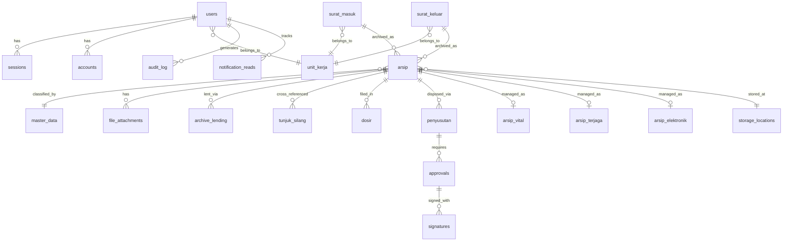

# SIMSA — Sistem Informasi Manajemen Surat dan Arsip
## Product Specification · ATR/BPN

> **Version**: 1.0.0  
> **Date**: 14 February 2026  
> **Regulatory Basis**: Permen ATR/BPN No. 2/2026 (Kearsipan), Permen No. 10/2018, Permen No. 8/2020

---

## 1. Executive Summary

SIMSA is a **full-stack web application** that digitises the end-to-end management of official correspondence (surat) and archives (arsip) for the **Ministry of Agrarian Affairs and Spatial Planning / National Land Agency** (Kementerian ATR/BPN). It covers the complete archival lifecycle — from incoming/outgoing letter registration, classification, retention scheduling, physical storage tracking, and disposition, all the way through to archive lending, electronic preservation, and regulatory form generation (33 Formulir per Permen ATR/BPN).

---

## 2. Technology Stack

| Layer | Technology |
|---|---|
| **Frontend** | React 19, Vite 7, Tailwind CSS 4, Radix UI, shadcn/ui, Recharts, Chart.js |
| **Backend** | Node.js, Express 5, TypeScript, Zod validation |
| **Database** | PostgreSQL via Drizzle ORM (26 schema tables, migrations) |
| **Auth** | Better Auth (email/password + Google OAuth), session-based |
| **File Storage** | Local `uploads/` directory (authenticated access) |
| **PDF/QR** | PDFKit, QRCode, Tesseract.js (OCR) |
| **Email** | Nodemailer |
| **API Docs** | Swagger (swagger-jsdoc + swagger-ui-express) |
| **Security** | Helmet.js, CORS, CSRF, rate limiting, compression |
| **Testing** | Vitest, Supertest, Testing Library |

---

## 3. User Roles & Access Control

| Role | Scope |
|---|---|
| `super_admin` | Full access — user management, settings, master data, audit log |
| `admin_dirjen` | Administrative access — most features except system settings |
| `admin_sesditjen` | Administrative access — scoped to Sesditjen unit |
| `auditor` | Read-only access to audit logs and reports |
| `user` | Standard — can manage letters, view archives, request loans |

**Access enforcement**: `ProtectedRoute` (auth gate) + `RoleGuard` (role check) wrappers on React Router. Backend enforces via session middleware.

**Session management**: 30-minute idle timeout with 5-minute pre-logout warning banner.

---

## 4. Modules & Features

### 4.1 Dashboard (`/`)
- Summary KPI cards: Surat Masuk, Surat Keluar, Arsip, Peminjaman
- Monthly trend bar/line charts (Recharts + Chart.js)
- Unit Kerja filter
- Pengawasan (supervision) widget

---

### 4.2 Manajemen Surat

#### 4.2.1 Surat Masuk (Incoming Mail) — `/surat/masuk`
- **List** with search, date-range filter, status filter, pagination
- **Create / Edit** (`/surat/masuk/tambah`, `/surat/masuk/edit/:id`) — full-form entry: nomor surat, tanggal, pengirim, perihal, klasifikasi picker, sifat surat, file upload
- **Detail view** (`/surat/masuk/:id`) — read-only display with action buttons
- **Archive from letter** — one-click archiving dialog with classification mapping
- Disposisi (internal routing instructions)
- Status tracking: `belum_dibalas` → `sudah_dibalas`

#### 4.2.2 Surat Keluar (Outgoing Mail) — `/surat/keluar`
- Same CRUD workflow as Surat Masuk, tailored for outgoing letters
- Fields: nomor surat, kepada (recipient), perihal, naskah dinas type, tanggal
- Detail view with full metadata

#### 4.2.3 Distribusi (Distribution) — `/distribusi`
- Distribution inbox for letter routing
- Track which units have received distributed letters
- Internal forwarding workflow

---

### 4.3 Siklus Hidup Arsip (Archive Lifecycle)

#### 4.3.1 Arsip Aktif (Active Archives) — `/arsip`
- Tabbed view: Arsip Surat Masuk + Arsip Surat Keluar
- Detail page (`/arsip/detail/:id`) with full archive metadata, classification, storage info, lifecycle widget
- Fields: kode klasifikasi, nomor berkas, uraian berkas, media type, jumlah, lokasi simpan, tanggal kadaluarsa, retensi, hasil akhir

#### 4.3.2 Pemberkasan / Dosir (Dossier Filing) — `/dosir`
- Create and manage dossiers (grouped archive folders)
- Detail view (`/dosir/:id`) with contained items
- Link archives to dossiers

#### 4.3.3 Jadwal Retensi Arsip / JRA (Retention Schedule) — `/master/jra`
- Master data for archive retention durations
- Fields: kode klasifikasi, aktif period, inaktif period, hasil akhir (musnah/permanen/dinilai kembali)
- Pre-seeded from Permen ATR/BPN regulations
- Mapping to classification codes

#### 4.3.4 Manajemen Retensi (Retention Management) — `/retention`
- Monitor archives approaching retention deadlines
- Batch selection of archives for review
- Status workflow tracking

#### 4.3.5 Penyusutan Arsip (Archive Disposition) — `/penyusutan`
- Three disposition types:
  - **Pemindahan**: Transfer from Unit Pengolah → Unit Kearsipan
  - **Pemusnahan**: Destruction of expired archives
  - **Penyerahan**: Transfer to Lembaga Kearsipan Nasional
- Multi-stage approval workflow: `draft` → `proposed` → `reviewed` → `approved` → `executed`
- Batch creation with candidate archive selection
- Print official forms (Berita Acara, Daftar Arsip)

---

### 4.4 Layanan & Fisik (Services & Physical)

#### 4.4.1 Layanan Arsip (Archive Services) — `/layanan-arsip`
- Request-based archive access service
- CRUD: create, list, detail view
- Track service requests and fulfilment status

#### 4.4.2 Peminjaman Arsip (Archive Lending) — `/archive-lending`
- Borrower info, department/unit, purpose
- Status tracking: `borrowed` → `returned` / `overdue`
- Due-date management with overdue detection
- Return processing

#### 4.4.3 Lokasi Simpan (Storage Locations) — `/storage-locations`
- Physical storage registry: gedung (building), lantai (floor), ruangan (room), rak (shelf), boks (box)
- CRUD management (admin-only)
- Link archives to specific physical locations

#### 4.4.4 Arsip Vital — `/arsip-vital`
- Manage vital/critical archives (admin-only)
- Special classification and protection status
- Vital archive registry and monitoring

#### 4.4.5 Arsip Terjaga (Protected Archives) — `/arsip-terjaga`
- Manage protected/guarded archives (admin-only)
- Compliance with national archive protection requirements
- Preservation tracking

---

### 4.5 Media & Autentikasi

#### 4.5.1 Arsip Elektronik (Electronic Archives) — `/arsip-elektronik`
- Manage born-digital and digitised archive records
- Media type tracking: kertas, foto, video, audio, elektronik
- File hash verification for integrity
- OCR capability (Tesseract.js) for scanned documents

#### 4.5.2 Autentikasi Arsip (Archive Authentication) — `/autentikasi`
- Create authentication records for archive copies
- Verify against original documents
- Official authentication certificate generation

#### 4.5.3 Tunjuk Silang (Cross-Reference Index) — `/tunjuk-silang`
- Cross-reference entries linking related archives
- Bidirectional reference tracking
- Search and browse cross-references

---

### 4.6 Administrasi

#### 4.6.1 Formulir (Official Forms) — `/formulir`
- **33 regulatory forms** (Formulir 1–33) per Permen ATR/BPN
- Browse all available form templates
- Print-ready viewer (`/formulir/cetak/:id`) with dedicated print layout
- Form types include:
  - Kartu kendali surat masuk/keluar
  - Lembar disposisi
  - Daftar arsip (aktif, inaktif, vital, terjaga)
  - Berita acara (pemindahan, pemusnahan, penyerahan)
  - Daftar pertelaan
  - And many more per regulation

#### 4.6.2 Laporan (Reports) — `/laporan`
- **5 report tabs**: Ringkasan, Surat Masuk, Surat Keluar, Arsip, Peminjaman
- Year and date-range filters
- Monthly trend charts (bar chart visualisation)
- Media type breakdown statistics
- **Export** to Excel and PDF

#### 4.6.3 Audit Log — `/audit-log`
- Track all user actions across the system
- Filter by user, action type, date range
- Admin + Auditor access only

#### 4.6.4 User Management — `/users`
- CRUD user accounts (super_admin only)
- Assign roles and unit kerja
- Activate/deactivate users

#### 4.6.5 Master Data
- **Klasifikasi Arsip** (`/master/klasifikasi`) — Hierarchical classification code tree per Permen ATR/BPN
- **Klasifikasi Picker** — Reusable searchable tree component for selecting classification codes throughout the app

#### 4.6.6 Settings — `/settings`
- **Profile tab**: User profile editing
- **Unit Kerja tab**: Organisational unit management
- **Templates tab**: Letter templates configuration
- **Preferences tab**: UI / system preferences (theme, etc.)
- Super admin only

---

## 5. Cross-Cutting Features

| Feature | Description |
|---|---|
| **Global Search** | Full-text search across surat and arsip (dedicated search service + route) |
| **Bulk Upload** | Batch import of letters/archives from spreadsheet files |
| **Print Templates** | Official print layouts for all forms, berita acara, etc. (PDFKit backend) |
| **Export** | Excel (ExcelJS) and PDF export across reports and data tables |
| **QR Codes** | QR code generation for archive tracking |
| **OCR** | Optical Character Recognition on uploaded scanned documents (Tesseract.js) |
| **Notifications** | In-app notification system with read tracking; email notifications (Nodemailer) |
| **Approval Workflow** | Multi-stage approval engine for archive disposition |
| **Digital Signatures** | Signature service infrastructure for official document signing |
| **Google Drive** | Integration service for cloud storage |
| **Error Boundaries** | React Error Boundary components for graceful degradation |
| **Offline Indicator** | Visual indicator when user loses connectivity |
| **Loading Skeletons** | Shimmer loading states across all data-heavy pages |
| **Idle Warning** | Auto-logout warning banner at 25 min idle, logout at 30 min |
| **Theme** | Dark/light mode via theme provider |
| **Breadcrumbs** | Contextual navigation breadcrumbs across all pages |
| **Responsive Layout** | Collapsible sidebar, mobile-friendly grid layouts |

---

## 6. Database Schema Overview



**26 schema tables**: `users`, `sessions`, `accounts`, `verifications`, `unit_kerja`, `surat_masuk`, `surat_keluar`, `arsip`, `file_attachments`, `audit_log`, `master_data`, `storage_locations`, `archive_lending`, `dosir`, `surat_distribution`, `penyusutan`, `arsip_vital`, `arsip_terjaga`, `arsip_elektronik`, `tunjuk_silang`, `klasifikasi_jra_mapping`, `autentikasi`, `layanan_arsip`, `notification_reads`, `preservasi_track`, `approvals`, `signatures`

---

## 7. API Architecture

**Base URL**: `/api`

| Route Prefix | Description |
|---|---|
| `/api/auth` | Better Auth endpoints (sign-in, sign-up, sign-out, session) |
| `/api/surat-masuk` | Incoming mail CRUD |
| `/api/surat-keluar` | Outgoing mail CRUD |
| `/api/arsip` | Archive CRUD and lifecycle |
| `/api/dosir` | Dossier management |
| `/api/distributions` | Mail distribution |
| `/api/archive-lending` | Lending/borrowing |
| `/api/klasifikasi` | Classification codes |
| `/api/jra` | Retention schedule |
| `/api/retention` | Retention monitoring |
| `/api/penyusutan` | Archive disposition |
| `/api/arsip-vital` | Vital archives |
| `/api/arsip-terjaga` | Protected archives |
| `/api/arsip-elektronik` | Electronic archives |
| `/api/autentikasi` | Authentication records |
| `/api/tunjuk-silang` | Cross-references |
| `/api/storage-locations` | Physical storage |
| `/api/layanan-arsip` | Archive services |
| `/api/bulk-upload` | Batch import |
| `/api/reports` | Report generation |
| `/api/search` | Global search |
| `/api/export` | Data export (Excel/PDF) |
| `/api/notifications` | Notifications |
| `/api/settings` | System settings |
| `/api/user-management` | User CRUD |
| `/api/audit-log` | Audit trail |
| `/api/approvals` | Approval workflow |
| `/api/uploads` | File upload |
| `/api/dashboard` | Dashboard stats |
| `/api/mapping` | Classification-JRA mapping |
| `/api/supervision` | Supervision/pengawasan |

**Documentation**: Swagger UI available at `/api-docs`

---

## 8. Security

### Implemented
- ✅ Helmet.js security headers (CSP, HSTS, X-Frame-Options)
- ✅ CORS with explicit origin whitelist
- ✅ CSRF protection (double-submit cookie pattern)
- ✅ Rate limiting (express-rate-limit)
- ✅ Session-based authentication (Better Auth)
- ✅ Password policy enforcement
- ✅ File type validation (magic bytes)
- ✅ SQL injection protection (Drizzle ORM parameterised queries)
- ✅ XSS protection via Helmet + React
- ✅ Authenticated file access (uploads directory)
- ✅ Idle session auto-logout
- ✅ Response compression

### Planned
- 🔄 Two-factor authentication (2FA)
- 🔄 IP whitelisting
- 🔄 Automated security scanning
- 🔄 Penetration testing

---

## 9. Regulatory Compliance

The application is designed to comply with the following Ministerial Regulations:

| Regulation | Coverage |
|---|---|
| **Permen ATR/BPN No. 2 Tahun 2026** | Primary kearsipan regulation — defines all 33 formulir templates, classification codes, retention schedules, and archive lifecycle procedures |
| **Permen No. 10 Tahun 2018** | Previous archival guidelines referenced for backward compatibility |
| **Permen No. 8 Tahun 2020** | Supplementary archival procedures |

The 33 formulir (Formulir 1–33) are implemented as dedicated React components and correspond to the official forms mandated by the regulations.

---

## 10. Deployment Architecture

```
┌─────────────────────────────────────────┐
│               Client Browser            │
│         React SPA (Vite build)          │
└──────────────┬──────────────────────────┘
               │ HTTPS
┌──────────────▼──────────────────────────┐
│          Express 5 Server               │
│  ┌─────────────────────────────────┐    │
│  │  Static files (Vite dist)       │    │
│  │  Better Auth handler            │    │
│  │  API routes (/api/*)            │    │
│  │  Swagger docs (/api-docs)       │    │
│  │  Protected uploads (/uploads)   │    │
│  └─────────────────────────────────┘    │
└──────────────┬──────────────────────────┘
               │
┌──────────────▼──────────────────────────┐
│          PostgreSQL Database            │
│       (Drizzle ORM migrations)          │
└─────────────────────────────────────────┘
```

---

## 11. Non-Functional Requirements

| Requirement | Implementation |
|---|---|
| **Performance** | Lazy-loaded pages (React.lazy + Suspense), response compression, loading skeletons |
| **Reliability** | Error boundaries, global error handler, graceful degradation |
| **Scalability** | Stateless API design, database indexing strategy |
| **Accessibility** | Radix UI accessible primitives, keyboard navigation |
| **Localisation** | Indonesian (Bahasa Indonesia) as primary language |
| **Browser Support** | Modern browsers (Vite target) |
| **PWA Ready** | vite-plugin-pwa + workbox-window configured |
